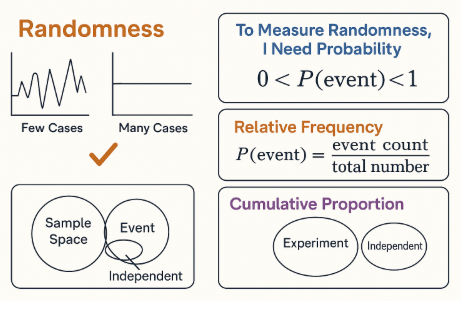
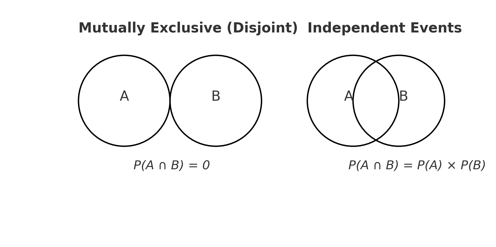

Ever flipped a coin and wondered why you got heads three times in a row? Welcome to the world of **randomness and probability** — where short-term surprises often give way to long-term patterns.

In this post, you'll explore what randomness really means, how we use **probability theory** to measure uncertainty, and how concepts like **sample space**, **mutual exclusivity**, and **tree diagrams** help us model real-world randomness — from games to machine learning.

---

<div class="series-nav">
  <p>📚 <strong>This post is part of the "Intro to Statistics" series</strong></p>
  <p>🔙 <strong>Previously:</strong> <a href="/posts/Regression/">Regression: Predicting Relationships Between Variables with the Best Fit Line</a></p>
  <p>🔜 <strong>Next:</strong> <a href="/posts/union-conditional/">Making Sense of Probabilities: Union, Tables, and Conditional Thinking</a></p>
</div>

---

## 🎲 <span style="color:#F06500;">What is Randomness?</span>

Randomness means outcomes vary in unpredictable ways — **in the short run**.

But here’s the twist:

> ✅ The more you repeat a random process, the more predictable the overall pattern becomes.

### Example:

- Flip a coin **5 times** → may get 3 heads, 2 tails  
- Flip it **5,000 times** → you'll get close to 50% heads

### 📊 Visual: Randomness in Small vs Large Samples




---

## 🔍 <span style="color:#1E90FF;">Measuring Randomness with Probability</span>

Probability is a number between 0 and 1 that describes the **likelihood** of an event.

\\[
0 < P(\text{event}) < 1
\\]

- 0 → impossible  
- 1 → certain  
- 0.5 → equal chance

For any complete experiment:

\\[
\sum P(\text{all possible events}) = 1
\\]

---

## 📈 <span style="color:#FFA500;">Relative Frequency & Cumulative Proportion</span>

When observing events over time, we can estimate probability with **relative frequency**:

\\[
P(\text{event}) = \frac{\text{event count}}{\text{total trials}}
\\]

The **cumulative proportion** is the running total of relative frequencies as trials increase — a clearer picture of probability.

> 🧠 Over time, the cumulative proportion settles down and reflects the true likelihood.

---

## 🧪 <span style="color:#20B2AA;">Basic Terms You Must Know</span>

- **Experiment**: A repeatable process with uncertain outcome  
  _e.g. rolling a die_

- **Event**: A specific result or set of results  
  _e.g. rolling a 6, or getting an even number_

- **Independent Events**: The result of one doesn’t affect the other  
  _e.g. two separate coin tosses_

- **Sample Space**: The set of all possible outcomes  
  _e.g. {1, 2, 3, 4, 5, 6} for a die_

---

## 🌳 <span style="color:#9370DB;">Using Tree Diagrams to Visualize Outcomes</span>

Let’s say you toss a coin and then roll a die.

``` sql
       Start
        |
    -----------
   H           T
 / | \       / | \
1  2  3     1  2  3 ...

```

Each **branch** represents a possible compound outcome (e.g. H-2), and we can **multiply probabilities** along the paths.

---

## 🧩 <span style="color:#8A2BE2;">Event Types in Probability</span>

### Mutually Exclusive  
Events that **cannot happen at the same time**  
_Example: Rolling a 2 and a 5 in one roll_

\\[
P(A \cap B) = 0
\\]

### Collectively Exhaustive  
Events that together **cover all possibilities**  
\\[
\sum P(\text{events}) = 1
\\]

### Complement Event  
All outcomes **not** in the event  
\\[
P(A^c) = 1 - P(A)
\\]

---

### 🔗 Disjoint vs Independent

| Type                          | Description                    | Rule                                  |
| ----------------------------- | ------------------------------ | ------------------------------------- |
| Disjoint (Mutually Exclusive) | Events don’t overlap           | \\( P(A \cap B) = 0 \\)               |
| Independent                   | Events don’t affect each other | \\( P(A \cap B) = P(A) \cdot P(B) \\) |

---

## 🔍 <span style="color:#228B22;">Venn Diagram: Disjoint vs Overlapping</span>




- **Disjoint events** → no overlap  
- **Independent events** → can overlap, but still multiply their probabilities
---
## 🤖 Why This Matters in Machine Learning

Probability and randomness aren’t just academic ideas — they power real-world machine learning.

- Algorithms like Naive Bayes and Hidden Markov Models rely on **probabilistic logic**.
- Concepts like **independence** and **conditional probability** are fundamental in model design.
- Randomness underlies **cross-validation**, **bootstrapping**, and even **neural network weight initialization**.

Understanding these foundations helps you avoid black-box thinking — and build better models.

---


---

<details class="level-up-box">
  <summary class="level-up-title">🧠 Level Up: Why This Matters</summary>
  <div class="level-up-content">
    <p>Understanding randomness and events helps you:</p>
    <ul>
      <li>🎯 Build simulations for decision-making</li>
      <li>🧠 Model uncertainty in machine learning and forecasting</li>
      <li>🔐 Analyze risk in finance, health, or engineering</li>
    </ul>
    <p class="mb-0">Next, we’ll look at probability <b>rules</b> — like the addition and multiplication rule — and how they apply in real problems.</p>
  </div>
</details>
---
<details class="custom-box custom-best">
  <summary><strong>✅ Best Practices for Probability & Randomness</strong></summary>
  <ul>
    <li>Visualize compound events with <strong>tree diagrams</strong> to map all outcomes clearly.</li>
    <li>Use <strong>cumulative relative frequencies</strong> to estimate long-term probabilities.</li>
    <li>Differentiate between <strong>disjoint</strong> and <strong>independent</strong> events before applying rules.</li>
    <li>Always define your <strong>sample space</strong> explicitly — it frames every calculation.</li>
  </ul>
</details>

---
<details class="custom-box custom-warning">
  <summary><strong>⚠️ Common Pitfalls</strong></summary>
  <ul>
    <li>❌ Assuming disjoint events are also independent — they’re not.</li>
    <li>❌ Forgetting that probabilities must sum to <strong>1</strong> for all possible outcomes.</li>
    <li>❌ Expecting short-term outcomes to always balance — this <strong>Gambler’s Fallacy</strong> is misleading.</li>
    <li>❌ Misinterpreting randomness as lack of pattern — patterns can emerge from chance!</li>
  </ul>
</details>

---

## 🧠 Summary

<table style="width:100%; border-collapse: collapse;">
  <thead>
    <tr style="background-color: #f0f8ff;">
      <th style="padding: 8px; border: 1px solid #ccc;">🎯 <strong>Concept</strong></th>
      <th style="padding: 8px; border: 1px solid #ccc;">💡 <strong>Meaning</strong></th>
    </tr>
  </thead>
  <tbody>
    <tr style="background-color: #ffffff;">
      <td style="padding: 8px; border: 1px solid #ddd;">Randomness</td>
      <td style="padding: 8px; border: 1px solid #ddd;">Unpredictable short-term, predictable long-term</td>
    </tr>
    <tr style="background-color: #f9f9f9;">
      <td style="padding: 8px; border: 1px solid #ddd;">Probability</td>
      <td style="padding: 8px; border: 1px solid #ddd;">Likelihood of an event (between 0 and 1)</td>
    </tr>
    <tr style="background-color: #ffffff;">
      <td style="padding: 8px; border: 1px solid #ddd;">Relative Frequency</td>
      <td style="padding: 8px; border: 1px solid #ddd;">Estimate based on observed trials</td>
    </tr>
    <tr style="background-color: #f9f9f9;">
      <td style="padding: 8px; border: 1px solid #ddd;">Sample Space</td>
      <td style="padding: 8px; border: 1px solid #ddd;">All possible outcomes</td>
    </tr>
    <tr style="background-color: #ffffff;">
      <td style="padding: 8px; border: 1px solid #ddd;">Mutually Exclusive</td>
      <td style="padding: 8px; border: 1px solid #ddd;">Can’t happen together</td>
    </tr>
    <tr style="background-color: #f9f9f9;">
      <td style="padding: 8px; border: 1px solid #ddd;">Collectively Exhaustive</td>
      <td style="padding: 8px; border: 1px solid #ddd;">Together cover all possibilities</td>
    </tr>
    <tr style="background-color: #ffffff;">
      <td style="padding: 8px; border: 1px solid #ddd;">Complement</td>
      <td style="padding: 8px; border: 1px solid #ddd;">All other outcomes</td>
    </tr>
    <tr style="background-color: #f9f9f9;">
      <td style="padding: 8px; border: 1px solid #ddd;">Independent</td>
      <td style="padding: 8px; border: 1px solid #ddd;">One event doesn’t affect the other</td>
    </tr>
    <tr style="background-color: #ffffff;">
      <td style="padding: 8px; border: 1px solid #ddd;">Tree Diagram</td>
      <td style="padding: 8px; border: 1px solid #ddd;">Shows compound outcomes</td>
    </tr>
    <tr style="background-color: #f9f9f9;">
      <td style="padding: 8px; border: 1px solid #ddd;">Venn Diagram</td>
      <td style="padding: 8px; border: 1px solid #ddd;">Visualize event relationships</td>
    </tr>
  </tbody>
</table>

---

## 💬 Got a question or suggestion?

Leave a comment below — I’d love to hear your thoughts or help if something was unclear.

---
## ✅ Up Next

In the next post, we’ll explore:
- **Addition Rule** for combined events  
- **Multiplication Rule** for independent events  
- **Conditional Probability** and its meaning  

Stay curious!
