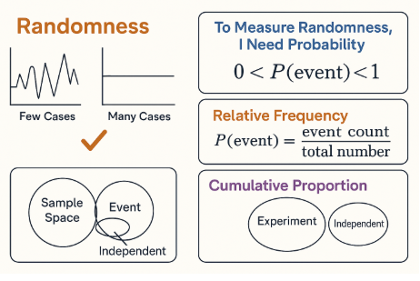
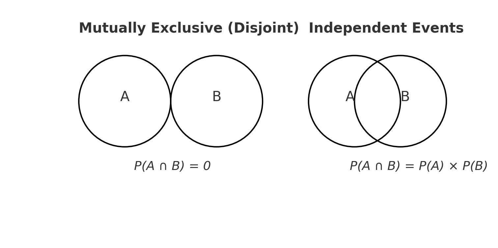

Ever flipped a coin and wondered: *Shouldn’t it be 50/50? Then why did I get 3 heads in a row?*

Welcome to the world of **randomness** — where short-term surprises often give way to long-term predictability.

---

<div class="series-nav">
  <p>📚 <strong>This post is part of the "Intro to Statistics" series</strong></p>
  <p>🔙 <strong>Previously:</strong> <a href="/posts/Regression/">Regression: Predicting Relationships Between Variables with the Best Fit Line</a></p>
  <p>🔜 <strong>Next:</strong> <a href="/posts/Regression/">Probability Rules</a></p>
</div>

---

## 🎲 <span style="color:#F06500;">What is Randomness?</span>

Randomness means outcomes vary in unpredictable ways — **in the short run**.

But here’s the twist:

> ✅ The more you repeat a random process, the more predictable the overall pattern becomes.

### Example:

- Flip a coin **5 times** → may get 3 heads, 2 tails  
- Flip it **5,000 times** → you'll get close to 50% heads

### 📊 Visual: Randomness in Small vs Large Samples




---

## 🔍 <span style="color:#1E90FF;">To Measure Randomness, We Use Probability</span>

Probability is a number between 0 and 1 that describes the **likelihood** of an event.

\\[
0 < P(\text{event}) < 1
\\]

- 0 → impossible  
- 1 → certain  
- 0.5 → equal chance

For any complete experiment:

\\[
\sum P(\text{all possible events}) = 1
\\]

---

## 📈 <span style="color:#FFA500;">Relative Frequency & Cumulative Proportion</span>

When observing events over time, we can estimate probability with **relative frequency**:

\\[
P(\text{event}) = \frac{\text{event count}}{\text{total trials}}
\\]

The **cumulative proportion** is the running total of relative frequencies as trials increase — a clearer picture of probability.

> 🧠 Over time, the cumulative proportion settles down and reflects the true likelihood.

---

## 🧪 <span style="color:#20B2AA;">Basic Terms You Must Know</span>

- **Experiment**: A repeatable process with uncertain outcome  
  _e.g. rolling a die_

- **Event**: A specific result or set of results  
  _e.g. rolling a 6, or getting an even number_

- **Independent Events**: The result of one doesn’t affect the other  
  _e.g. two separate coin tosses_

- **Sample Space**: The set of all possible outcomes  
  _e.g. {1, 2, 3, 4, 5, 6} for a die_

---

## 🌳 <span style="color:#9370DB;">Tree Diagram Example</span>

Let’s say you toss a coin and then roll a die.

``` sql
       Start
        |
    -----------
   H           T
 / | \       / | \
1  2  3     1  2  3 ...

```

Each **branch** represents a possible compound outcome (e.g. H-2), and we can **multiply probabilities** along the paths.

---

## 🧩 <span style="color:#8A2BE2;">Types of Events</span>

### Mutually Exclusive  
Events that **cannot happen at the same time**  
_Example: Rolling a 2 and a 5 in one roll_

\\[
P(A \cap B) = 0
\\]

### Collectively Exhaustive  
Events that together **cover all possibilities**  
\\[
\sum P(\text{events}) = 1
\\]

### Complement Event  
All outcomes **not** in the event  
\\[
P(A^c) = 1 - P(A)
\\]

---

### 🔗 Disjoint vs Independent

| Type | Description | Rule |
|------|-------------|------|
| Disjoint (Mutually Exclusive) | Events don’t overlap | \\( P(A \cap B) = 0 \\) |
| Independent | Events don’t affect each other | \\( P(A \cap B) = P(A) \cdot P(B) \\) |

---

## 🔍 <span style="color:#228B22;">Venn Diagram: Disjoint vs Overlapping</span>




- **Disjoint events** → no overlap  
- **Independent events** → can overlap, but still multiply their probabilities

---
<details class="border rounded p-3 bg-light my-4">
  <summary class="fw-bold text-primary">🧠 Level Up: Why This Matters</summary>
  <div class="mt-2">
    <p>Understanding randomness and events helps you:</p>
    <ul>
      <li>🎯 Build simulations for decision-making</li>
      <li>🧠 Model uncertainty in machine learning and forecasting</li>
      <li>🔐 Analyze risk in finance, health, or engineering</li>
    </ul>
    <p class="mb-0">Next, we’ll look at probability <b>rules</b> — like the addition and multiplication rule — and how they apply in real problems.</p>
  </div>
</details>
---


---

## 🧠 Summary

| Concept | Meaning |
|--------|---------|
| Randomness | Unpredictable short-term, predictable long-term |
| Probability | Likelihood of an event (between 0 and 1) |
| Relative Frequency | Estimate based on observed trials |
| Sample Space | All possible outcomes |
| Mutually Exclusive | Can’t happen together |
| Collectively Exhaustive | Together cover all possibilities |
| Complement | All other outcomes |
| Independent | One event doesn’t affect the other |
| Tree Diagram | Shows compound outcomes |
| Venn Diagram | Visualize event relationships |

---

## ✅ Up Next

In the next post, we’ll explore:
- **Addition Rule** for combined events  
- **Multiplication Rule** for independent events  
- **Conditional Probability** and its meaning  

Stay curious!
