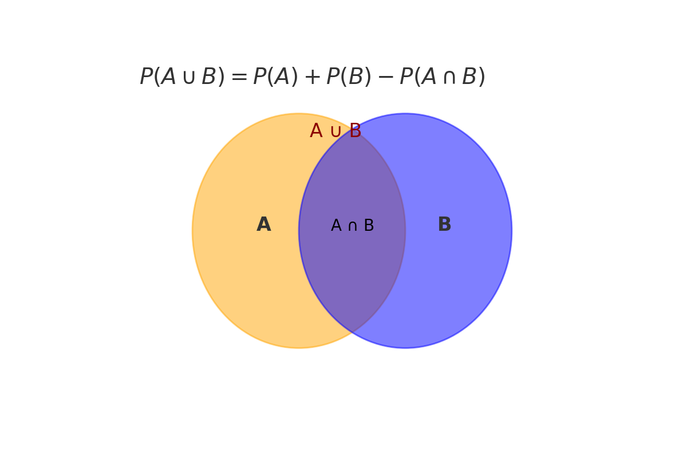
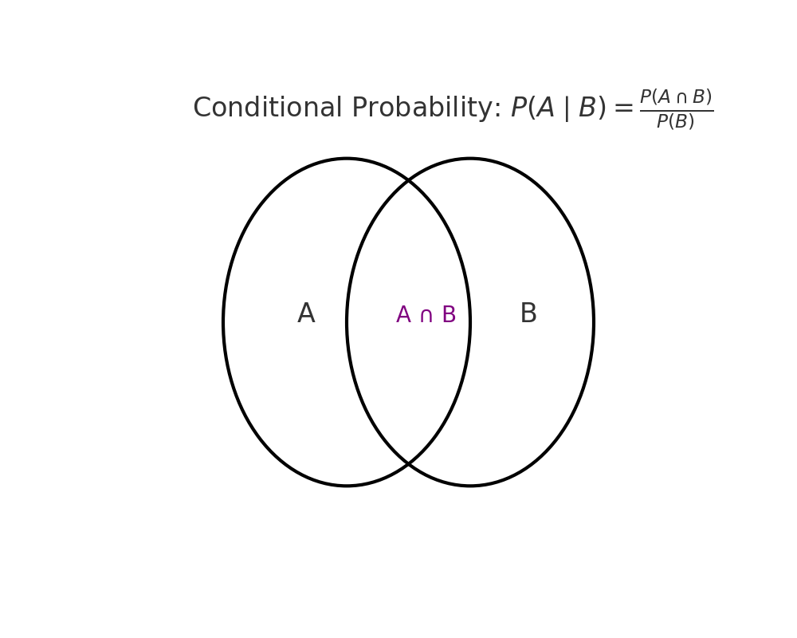

When working with data, it’s critical to understand how probabilities interact — especially when events overlap or depend on one another. In this post, you'll learn how to calculate unions, read contingency tables, and understand conditional probabilities using intuitive visuals and real-life examples.

---

  
📚 <strong>This post is part of the "Intro to Statistics" series</strong>

  
🔙 <strong>Previously:</strong><a href="/posts/Randomness/">How Random Is Random? Understanding Probability and Events</a> 

  
🔜 <strong>Next:</strong> <a href="/posts/Bayes-_Rule/">Understanding Bayez-Rule</a><

---

## 🔗 Union of Events: The Addition Rule

When calculating the probability of **A or B**, we combine the probabilities — but subtract any overlap:

\\[
P(A \cup B) = P(A) + P(B) - P(A \cap B)
\\]

> This is called the **Addition Rule**.

### ✅ Special Case: Disjoint Events

If A and B are **mutually exclusive** (disjoint), then \\( P(A \cap B) = 0 \\), so:

\\[
P(A \cup B) = P(A) + P(B)
\\]

📊 **Visual Aid Placeholder**  

---

## 📊 Marginal and Joint Proportions with Tables

Let’s say we ask 100 people whether they own a dog or a cat:

|              | Owns Dog | No Dog | Total |
| ------------ | -------- | ------ | ----- |
| **Owns Cat** | 20       | 30     | 50    |
| **No Cat**   | 25       | 25     | 50    |
| **Total**    | 45       | 55     | 100   |

### 🧩 What Are Margins?

- The totals in the last row and column are called **marginal totals**.
- Their **proportions** (divided by total) are **marginal proportions**:
  - Example: \\( P(\text{Owns Dog}) = 45 / 100 = 0.45 \\)

---

## 🔄 Joint Probability Table

To convert to **probabilities**, divide each cell by total:

|              | Owns Dog (D) | No Dog | Total |
| ------------ | ------------ | ------ | ----- |
| Owns Cat (C) | 0.20         | 0.30   | 0.50  |
| No Cat       | 0.25         | 0.25   | 0.50  |
| **Total**    | 0.45         | 0.55   | 1.00  |

These are **joint probabilities** (each cell shows \\( P(C \cap D) \\), etc).

✅ Total of each **row/column = 1**  
✅ This set of events is **jointly exhaustive**

> 💡 You can compute **marginal probabilities** by summing across rows or columns.

⚠️ But you can't always reverse this — joint probability can't be recovered from marginal alone.

---

## 📌 Conditional Probability: What If We Know B Happened?

Conditional probability is:

\\[
P(A \mid B) = \frac{P(A \cap B)}{P(B)}
\\]

> Read as “the probability of A **given** B.”

📊 **Venn Diagram Placeholder**  

---

### 🧪 Problem 1 — Using the Table

**Q:** What’s the probability that a person owns a cat **given** they own a dog?

\\[
P(\text{Cat} \mid \text{Dog}) = \frac{P(\text{Cat and Dog})}{P(\text{Dog})} = \frac{0.20}{0.45} \approx 0.444
\\]

---

### 🧪 Problem 2 — Medical Testing Example

|            | Disease (+) | No Disease (−) | Total |
| ---------- | ----------- | -------------- | ----- |
| **Test +** | 40          | 10             | 50    |
| **Test −** | 10          | 40             | 50    |
| **Total**  | 50          | 50             | 100   |

Let’s convert to probabilities:

\\[
P(\text{Disease} \mid \text{Test +}) = \frac{40}{50} = 0.8
\\]

🧠 The test is **positive**, and there's an **80% chance** the person actually has the disease.

---
## 🤖 Why This Matters to Machine Learning

Understanding **probability rules** is foundational to many ML algorithms:

- **Naive Bayes classifiers** rely on conditional probability.
- **Confusion matrices** and **precision/recall** relate to joint and marginal probabilities.
- Probabilistic reasoning underlies **Bayesian networks**, **Hidden Markov Models**, and **likelihood estimation**.

By mastering unions, intersections, and conditional logic, you're building the intuition needed for more complex ML reasoning.

---



---

  
🧠 Level Up: Know When to Use Conditional Probabilities

  

    
Conditional probability isn’t just for math exams — it powers real-world decisions:

    <ul>
      <li>🩺 In medical testing, it tells us the chance a patient actually has a condition, given a positive test.</li>
      <li>📈 In finance, it helps estimate risks based on market behavior.</li>
      <li>🧠 In machine learning, it's the backbone of models like <em>Naive Bayes</em> and <em>Bayesian networks</em>.</li>
    </ul>
    
Mastering it helps you move from counting events to thinking conditionally — just like algorithms do.

  

---

  
<strong>✅ Best Practices for Probability Thinking</strong>

  <ul>
    <li>Use **Venn diagrams** or tables to clarify overlap and independence.</li>
    <li>Double-check whether events are **mutually exclusive** or **independent** — they’re not the same!</li>
    <li>Normalize tables to probabilities for clearer analysis.</li>
    <li>Label everything clearly: A, B, A ∩ B, A ∪ B, etc.</li>
  </ul>

---

  
<strong>⚠️ Common Pitfalls</strong>

  <ul>
    <li>❌ Assuming disjoint events are independent.</li>
    <li>❌ Forgetting to subtract the intersection in union calculations.</li>
    <li>❌ Using marginal totals to infer conditional relationships directly.</li>
  </ul>

---
## 🧠 Summary

| Concept                         | Meaning                                       |
| ------------------------------- | --------------------------------------------- |
| Union of A and B                | Add both, subtract intersection               |
| Disjoint events                 | No overlap: \\( P(A \cup B) = P(A) + P(B) \\) |
| Marginal proportion             | Total rows/columns ÷ total cases              |
| Joint probability               | Cell ÷ total                                  |
| Conditional \\( P(A \mid B) \\) | Probability of A given B                      |

---
## ✅ Up Next

We’ll now explore **probability rules in depth**, including:
- Complement rules  
- Bayes’ Theorem  
- Advanced conditional reasoning

See you there!

---
## 📺 Explore the Channel

  
  

  <h3 style="margin-top: 16px; color: #333;">🎥 Hoda Osama AI</h3>
  
Learn statistics and machine learning concepts step by step with visuals and real examples.

  
  <a href="https://www.youtube.com/@Hoda_Osama_AI" target="_blank" rel="noopener noreferrer">
    <button style="margin-top: 12px; padding: 10px 20px; font-size: 16px; background-color: #FF0000; color: white; border: none; border-radius: 6px; cursor: pointer;">
      🔔 Subscribe on YouTube
    </button>
  </a>

---
## 💬  Got a Question? 

Leave a comment or open an issue on GitHub — I love connecting with other learners and builders. 🔁
