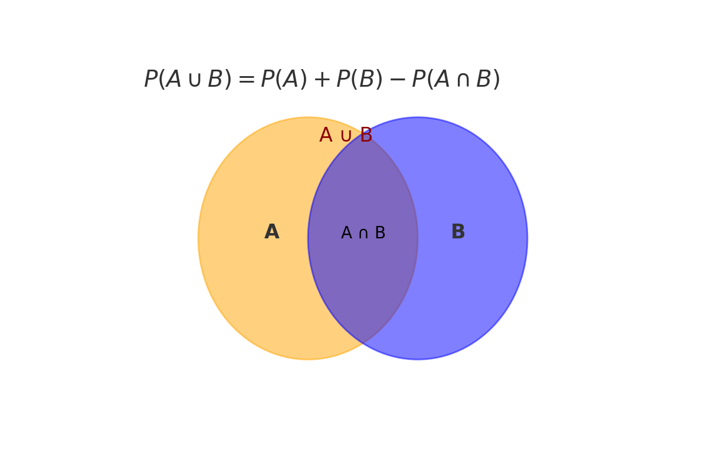
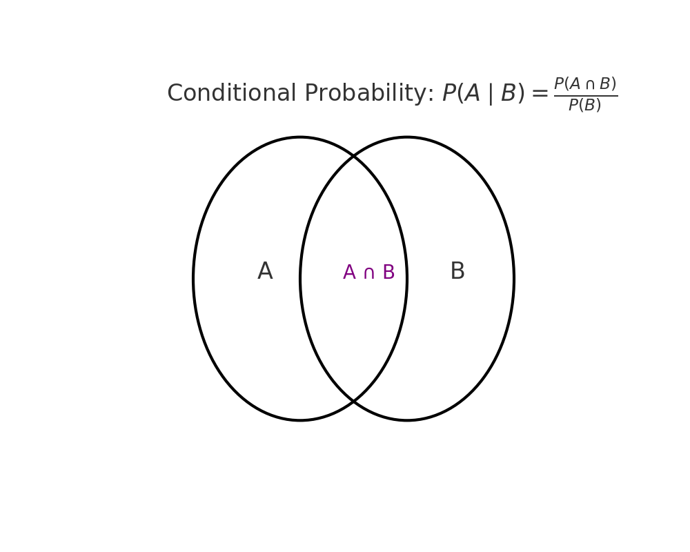

How can we combine probabilities when events overlap?  
What do those totals in a table mean?  
Let’s break it all down — and build toward smarter probability thinking.

---

  
📚 <strong>This post is part of the "Intro to Statistics" series</strong>

  
🔙 <strong>Previously:</strong><a href="/posts/Randomness/">How Random Is Random? Understanding Probability and Events</a> 

  
🔜 <strong>Next:</strong> <a href="/posts/Bayes-_Rule/">Understanding Bayez-Rule</a><

---

## 🔗 Union of Events: The Addition Rule

When calculating the probability of **A or B**, we combine the probabilities — but subtract any overlap:

\\[
P(A \cup B) = P(A) + P(B) - P(A \cap B)
\\]

> This is called the **Addition Rule**.

### ✅ Special Case: Disjoint Events

If A and B are **mutually exclusive** (disjoint), then \\( P(A \cap B) = 0 \\), so:

\\[
P(A \cup B) = P(A) + P(B)
\\]

📊 **Visual Aid Placeholder**  

---

## 📊 Marginal and Joint Proportions with Tables

Let’s say we ask 100 people whether they own a dog or a cat:

|                 | Owns Dog | No Dog | Total |
|-----------------|----------|--------|-------|
| **Owns Cat**    |   20     |   30   |  50   |
| **No Cat**      |   25     |   25   |  50   |
| **Total**       |   45     |   55   | 100   |

### 🧩 What Are Margins?

- The totals in the last row and column are called **marginal totals**.
- Their **proportions** (divided by total) are **marginal proportions**:
  - Example: \\( P(\text{Owns Dog}) = 45 / 100 = 0.45 \\)

---

## 🔄 Joint Probability Table

To convert to **probabilities**, divide each cell by total:

|                 | Owns Dog (D) | No Dog | Total |
|-----------------|-------------|--------|-------|
| Owns Cat (C)    | 0.20         | 0.30   | 0.50  |
| No Cat          | 0.25         | 0.25   | 0.50  |
| **Total**       | 0.45         | 0.55   | 1.00  |

These are **joint probabilities** (each cell shows \\( P(C \cap D) \\), etc).

✅ Total of each **row/column = 1**  
✅ This set of events is **jointly exhaustive**

> 💡 You can compute **marginal probabilities** by summing across rows or columns.

⚠️ But you can't always reverse this — joint probability can't be recovered from marginal alone.

---

## 📌 Conditional Probability: What If We Know B Happened?

Conditional probability is:

\\[
P(A \mid B) = \frac{P(A \cap B)}{P(B)}
\\]

> Read as “the probability of A **given** B.”

📊 **Venn Diagram Placeholder**  

---

### 🧪 Problem 1 — Using the Table

**Q:** What’s the probability that a person owns a cat **given** they own a dog?

\\[
P(\text{Cat} \mid \text{Dog}) = \frac{P(\text{Cat and Dog})}{P(\text{Dog})} = \frac{0.20}{0.45} \approx 0.444
\\]

---

### 🧪 Problem 2 — Medical Testing Example

|               | Disease (+) | No Disease (−) | Total |
|---------------|-------------|----------------|--------|
| **Test +**    | 40          | 10             | 50     |
| **Test −**    | 10          | 40             | 50     |
| **Total**     | 50          | 50             | 100    |

Let’s convert to probabilities:

\\[
P(\text{Disease} \mid \text{Test +}) = \frac{40}{50} = 0.8
\\]

🧠 The test is **positive**, and there's an **80% chance** the person actually has the disease.

---

  
🧠 Try It Yourself: Union & Conditional Thinking

  

    
<strong>Q1:</strong> If A and B are disjoint, what is 
    \( P(A \cup B) \)?

    

      
<strong>💡 Show Answer</strong>

      
\( P(A) + P(B) \)

    

    
<strong>Q2:</strong> How do you compute a joint probability in a table?

    

      
<strong>💡 Show Answer</strong>

      
Divide each cell count by the grand total.

    

    
<strong>Q3:</strong> What is \( P(A \mid B) \)?

    

      
<strong>💡 Show Answer</strong>

      
\( P(A \cap B) / P(B) \)

    

  

---



---
## 🧠 Summary

| Concept              | Meaning                                                |
|----------------------|--------------------------------------------------------|
| Union of A and B     | Add both, subtract intersection                       |
| Disjoint events      | No overlap: \\( P(A \cup B) = P(A) + P(B) \\)         |
| Marginal proportion  | Total rows/columns ÷ total cases                      |
| Joint probability    | Cell ÷ total                                           |
| Conditional \\( P(A \mid B) \\) | Probability of A given B                    |

---

## ✅ Up Next

We’ll now explore **probability rules in depth**, including:
- Complement rules  
- Bayes’ Theorem  
- Advanced conditional reasoning

See you there!
