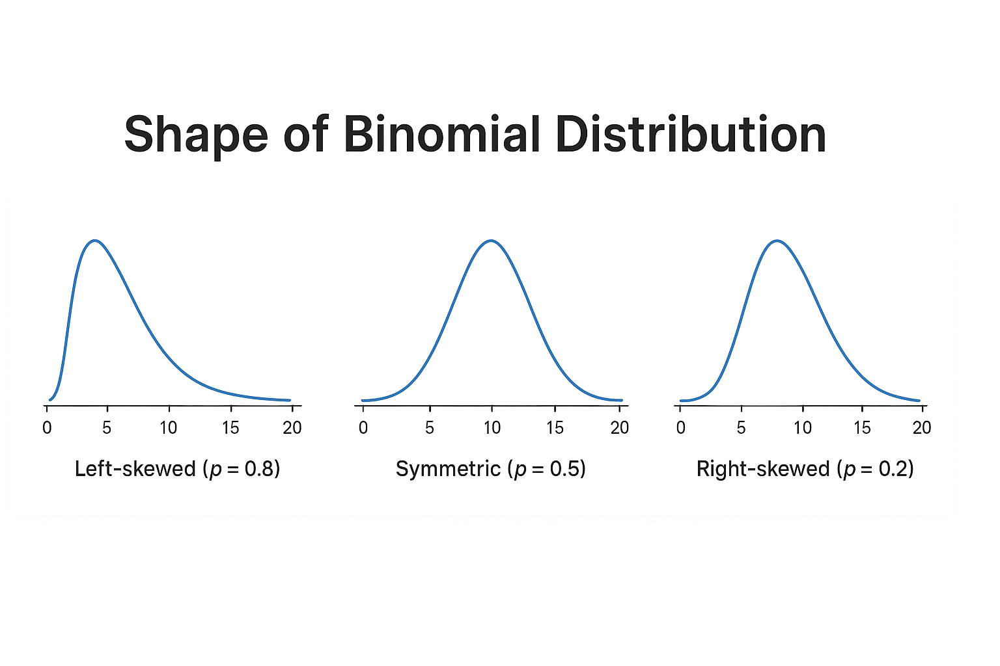

## 🎯  What is Binomial Distribution? 

The **binomial distribution** is a powerful statistical tool used to model the number of successes in a fixed number of trials, each with the same probability of success. Whether you're testing products, analyzing survey responses, or building a machine learning classifier, understanding how binomial outcomes work helps you make smarter, data-driven decisions. 
In this post, you'll learn how to recognize binomial settings, calculate probabilities, and apply the formula to real-world and ML-inspired scenarios.

---

  
📚 <strong>This post is part of the "Intro to Statistics" series</strong>

  
🔙 <strong>Previously:</strong> <a href="/posts/z-distribution/" style="color:#FF6F61;">Understanding Z-Distribution and Using the Z-Table</a>

  
🔜 <strong>Next:</strong> <a href="/posts/samples-distribution/" style="color:#1E90FF;">From Sample to Population: Basics of Sampling in Statistics</a>

---

## ⚙️  Conditions for a Binomial Experiment 

For a scenario to follow a binomial distribution, two essential conditions must be met:

1. The **probability of success** \\( p \\) is **constant** for every trial.
2. The **trials are independent** — the outcome of one does not affect the others.

---

## 🧱  Components of a Binomial Experiment 

A binomial distribution is built on the following:

1. A **Bernoulli trial**: one trial with two possible outcomes (Success or Failure) and constant probability \\( p \\).
2. Observe **\\( n \\)** such trials.
3. Count the number of successes: \\( x \\).

---

## 📐  The Binomial Probability Mass Function (PMF) 

The binomial formula calculates the probability of exactly \\( x \\) successes in \\( n \\) trials:

\\[
P(X = x) = \binom{n}{x} p^x (1 - p)^{n - x}
\\]

Where:
- \\( \binom{n}{x} = \frac{n!}{x!(n - x)!} \\) is the number of combinations ("n choose x")
- \\( p \\) is the probability of success
- \\( 1 - p \\) is the probability of failure

This is a **probability mass function** because it deals with **discrete values**.

---

## 🧮  Example: Tossing a Biased Coin 

Suppose a coin has a 70% chance of landing heads (success). You flip it **5 times**. What is the probability of getting **exactly 3 heads**?

Let:
- \\( n = 5 \\)
- \\( x = 3 \\)
- \\( p = 0.7 \\)

Then:
\\[
P(X = 3) = \binom{5}{3} (0.7)^3 (0.3)^2 = 10 \times 0.343 \times 0.09 = 0.3087
\\]

So, there's a **30.87% chance** of getting exactly 3 heads.

---

## 💡Real-World Example: Spam Classification
  

    

      Imagine you're evaluating a spam classifier. You test it on <strong>20 emails</strong> known to be spam.  
      The model correctly flags <strong>15 of them</strong> as spam.
    

    

      If the classifier has a <strong>true positive rate</strong> of 75%, what’s the probability of it flagging exactly 15 out of 20 correctly?
    

    

      This is a classic case for the <strong>binomial probability formula</strong>:
    

    
<code>P(X = 15) = C(20, 15) × (0.75)15 × (0.25)5</code>

    

      You can compute this using a calculator or code — this setup is common in <strong>model evaluation</strong> and <strong>A/B testing</strong>.
    

  

---

## 📈  Cumulative Binomial Probability 

To find the **probability of at most \\( x \\)** successes:

\\[
P(X \leq x) = \sum_{k=0}^{x} \binom{n}{k} p^k (1 - p)^{n - k}
\\]

### 🔍 Example: 

You flip a fair coin \\( n = 4 \\) times. What’s the probability of getting **at most 2 heads**?
Let \\( p = 0.5 \\)

\\[
P(X \leq 2) = P(X=0) + P(X=1) + P(X=2)
\\]

Compute each:

- \\( P(X=0) = \binom{4}{0}(0.5)^0(0.5)^4 = 1 \times 1 \times 0.0625 = 0.0625 \\)
- \\( P(X=1) = \binom{4}{1}(0.5)^1(0.5)^3 = 4 \times 0.5 \times 0.125 = 0.25 \\)
- \\( P(X=2) = \binom{4}{2}(0.5)^2(0.5)^2 = 6 \times 0.25 \times 0.25 = 0.375 \\)

\\[
P(X \leq 2) = 0.0625 + 0.25 + 0.375 = 0.6875
\\]

So, there's a **68.75% chance** of getting 2 or fewer heads.

---

## 🧭  Symmetry and Skewness 

The **shape** of a binomial distribution depends on the probability \( p \):

- If \\( p = 0.5 \\): the distribution is **symmetric**.
- If \\( p < 0.5 \\): it is **right-skewed**.
- If \\( p > 0.5 \\): it is **left-skewed**.

The spread is **widest** when the distribution is symmetric (i.e., \( p = 0.5 \)).

---

## 📊  Mean and Standard Deviation 

The **Mean (Expected Value)** and **Standard Deviation** give insights into the center and spread of the distribution:

### ✅ Mean (\\( \mu \\)):
\\[
\mu = n \cdot p
\\]
This tells us the average number of successes over many trials.

### ✅ Standard Deviation (\\( \sigma \\)):
\\[
\sigma = \sqrt{n \cdot p \cdot (1 - p)}
\\]
This quantifies the variability around the mean.

### 📌 Example:

You roll a die 12 times. The chance of rolling a 6 (success) is \\( p = \\frac{1}{6} \\). What are the mean and standard deviation?

- \\( n = 12 \\)
- \\( p = \frac{1}{6} \\)

\\[
\mu = 12 \cdot \frac{1}{6} = 2
\\]
\\[
\sigma = \sqrt{12 \cdot \frac{1}{6} \cdot \frac{5}{6}} = \sqrt{1.6667} \approx 1.29
\\]

So, you expect on average **2 sixes**, with a standard deviation of **about 1.29**.

---
## 🤖 Relevance to Machine Learning

- **Bernoulli & Binomial distributions** are foundational in **probabilistic models** — e.g., Naive Bayes, logistic regression.
- **Binary classification** tasks often assume **Bernoulli trials** (success/failure).
- **Performance metrics** (like precision and recall) relate to binomial outcomes in repeated experiments (e.g., cross-validation).
- Understanding binomial assumptions helps assess **model calibration** and **confidence estimation**.

---

    
🧠 Level Up: When to Use the Binomial Model

  

    <ul>
      <li>The binomial model is perfect for yes/no, win/lose, pass/fail scenarios.</li>
      <li>It's used in genetics, quality control, clinical trials, and surveys.</li>
      <li>When \( n \) is large and \( p \) isn't too close to 0 or 1, the binomial distribution approximates the normal distribution.</li>
      <li>Use statistical software or binomial calculators when \( n \) is big or cumulative probabilities are needed.</li>
    </ul>
  

---

  
<strong>✅ Best Practices</strong>

  <ul>
    <li>✅ Verify all <strong>trials are independent</strong> before applying the binomial model.</li>
    <li>✅ Use binomial formulas when dealing with <strong>binary outcomes</strong> (e.g., yes/no, win/loss).</li>
    <li>✅ Use a binomial calculator or code for large \( n \), to avoid factorial overflows.</li>
    <li>✅ Know when to use <strong>cumulative probability</strong> vs. exact success count.</li>
  </ul>

---

  
<strong>⚠️ Common Pitfalls</strong>

  <ul>
    <li>❌ Applying binomial logic when trials are <strong>not independent</strong> (e.g., without replacement).</li>
    <li>❌ Confusing binomial distribution with geometric or Poisson models.</li>
    <li>❌ Forgetting the <strong>fixed number of trials</strong> condition (must know \( n \)).</li>
    <li>❌ Misinterpreting “at most” vs “exactly” in cumulative questions.</li>
  </ul>

---


---

## ✅ Summary

| Concept | Description |
|--------|-------------|
| Binary Outcome | Each trial has two outcomes: success or failure |
| Bernoulli Trial | A single trial with constant \\( p \\) |
| PMF | Formula: \\( \\binom{n}{x} p^x (1 - p)^{n - x} \\) |
| Cumulative Probability | \\( P(X \\leq x) = \\sum_{k=0}^x \\binom{n}{k} p^k (1-p)^{n-k} \\) |
| Symmetry & Skewness | Depends on \\( p \\): symmetric if \\( p=0.5 \\), right-skewed if \\( p < 0.5 \\), left-skewed if \\( p > 0.5 \\) |
| Mean & Std. Dev. | \\( \\mu = np \\), \\( \\sigma = \\sqrt{np(1-p)} \\) |

---
## 💬 Got a question or suggestion?

Leave a comment below — I’d love to hear your thoughts or help if something was unclear.

---
## 🔜 Up Next

Next, we’ll explore the **Sampling Distribution of the Sample Mean** — a fundamental concept in inferential statistics used to understand how sample means behave.

Stay curious!
