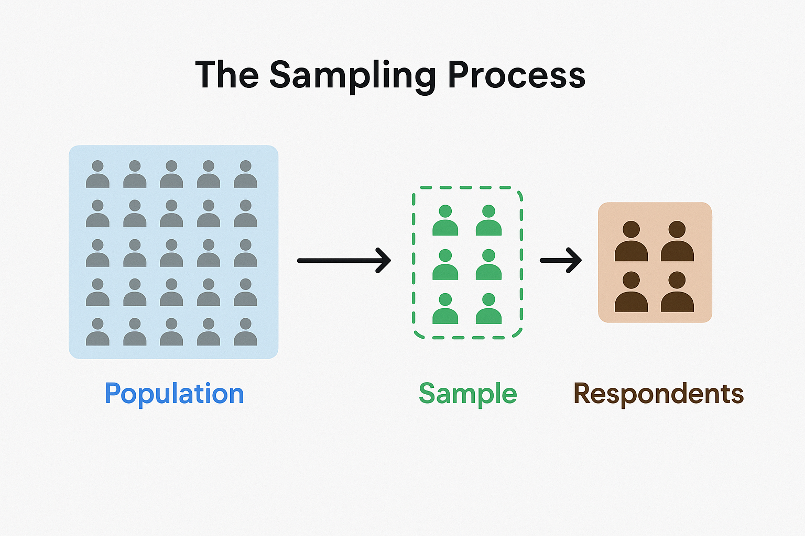

## 🎯  What’s the Difference Between a Population and a Sample? 

Understanding the difference between **a population and a sample** is fundamental to mastering statistics and data analysis. A population includes **every individual or observation of interest**, while a sample is **a representative subset** used to make inferences. 
Sampling lets you draw powerful conclusions without collecting data from everyone — a key principle behind both **inferential statistics** and **machine learning.**

---

  
📚 <strong>This post is part of the "Intro to Statistics" series</strong>

  
🔙 <strong>Previously:</strong> <a href="/posts/binomial-distribution/" style="color:#FF6F61;">Understanding Binomial Distribution</a>

  
🔜 <strong>Next:</strong> <a href="/posts/central-limit-theorem/" style="color:#1E90FF;">Understanding the Sampling Distribution of the Sample Mean and the Central Limit Theorem</a>

---

## 🔍  Parameters vs. Statistics 

When we study data:

- The **characteristics of a population** are called **parameters** — written using **Greek letters** (e.g., \\( \mu \\), \\( \sigma \\)).
- The **characteristics of a sample** are called **statistics** — written using **Roman letters** (e.g., \\( \bar{x} \\), \\( s \\)).

We use **inferential statistics** to **predict population parameters** from **sample statistics**.

---

## 🧪  The Importance of Simple Random Sampling 

To make sure our sample fairly represents the population, we often use a **Simple Random Sample (SRS)**.

In SRS:
- Every member of the population has an **equal chance** of being selected.
- This helps reduce bias and increases the accuracy of our predictions.

---

## 🧭  How to Take a Simple Random Sample 

1. **Define your population**.
2. **Create a sampling frame** — a complete list of all cases.
3. **Use random methods** (like a random number generator) to select your sample.
4. **Contact the selected respondents** using:
   - Face-to-face interviews
   - Phone calls
   - Online or paper questionnaires *(easiest but less accurate)*

---

## ⚠️  Common Sampling Errors and Biases 

Even with careful planning, things can go wrong:

- **Undercoverage Bias**: Not all classes or groups are included in the sampling frame.
- **Sampling Bias**: For example, choosing a convenient sample (only nearby people).
- **Non-response Bias**: Selected individuals don’t respond.
- **Response Bias**: People give inaccurate answers (on purpose or by mistake).

> 🎯 Making a truly random sample is **not easy**, especially with real-world constraints.

---

## 🧰  Other Sampling Techniques 

When Simple Random Sampling is too difficult, we use other methods:

### 1. Stratified Random Sampling
- The population is divided into groups (**strata**).
- A random sample is taken from each stratum.
- Works best when strata are clearly defined and understood.

### 2. Multistage Cluster Sampling
- Useful when there is no complete sampling frame.
- Select groups (clusters) randomly, then sample within them.

✅ In both techniques, **knowing the population structure** (strata or clusters) is key.

---
## 📡 Relevance to Machine Learning

Understanding sampling is critical for:

- **Model training**: Most ML models are trained on a sample (training set), not the full population.
- **Avoiding bias**: Biased sampling can lead to models that don’t generalize well.
- **Cross-validation**: Techniques like k-fold cross-validation depend on fair random samples.
- **Data imbalance**: Knowing how to sample different classes correctly can improve classification performance.

💡 Whether you’re balancing a dataset, evaluating a model, or testing generalization — sampling is at the heart of fair ML workflows.

---
## 📏  Bigger Is Better… But Randomness Matters 

- A **larger sample** reduces random error.
- But if it's not **random**, the results can still be misleading.

🎯 Randomness beats size if you must choose.

---

  
🧠 Level Up: Real-World Sampling Challenges

  

    <ul>
      <li>Sampling frames may be outdated or incomplete — especially in population surveys.</li>
      <li>People may opt out of participation, especially in phone or online surveys.</li>
      <li>Oversampling certain strata is a valid strategy when some groups are small but important.</li>
      <li>Weighting responses after collection can help adjust for biases — but requires expertise.</li>
    </ul>
  

---

  
<strong>✅ Best Practices in Sampling</strong>

  <ul>
    <li>Define your population clearly before sampling.</li>
    <li>Prefer Simple Random Sampling when feasible — it minimizes bias.</li>
    <li>Use stratified sampling when subgroups vary significantly.</li>
    <li>Keep sampling frames up to date to avoid undercoverage.</li>
  </ul>

---

  
<strong>⚠️ Common Pitfalls</strong>

  <ul>
    <li>❌ Using convenience samples — these rarely generalize well.</li>
    <li>❌ Ignoring non-response bias in surveys.</li>
    <li>❌ Overgeneralizing from a small or biased sample.</li>
    <li>❌ Confusing sample statistics with population parameters without inference.</li>
  </ul>

---


---

## ✅ Summary

| Concept | Description |
|----------------|-------------|
| Population | The entire group you're interested in |
| Sample | A subset selected from the population |
| Parameters | Characteristics of population (\\( \mu, \sigma \\)) |
| Statistics | Characteristics of sample (\\( \bar{x}, s \\)) |
| SRS | Simple Random Sample: equal chance selection |
| Bias Types | Undercoverage, Sampling, Non-response, Response |
| Other Techniques | Stratified, Cluster sampling |

---
## 💬 Got a question or suggestion?

Leave a comment below — I’d love to hear your thoughts or help if something was unclear.

---
## 🔜 Up Next

In the next post, we’ll explore the **Sampling Distribution of the Sample Mean** — how sample averages behave, the **Central Limit Theorem**, and why these concepts form the foundation of many statistical procedures

Stay curious! 📊
