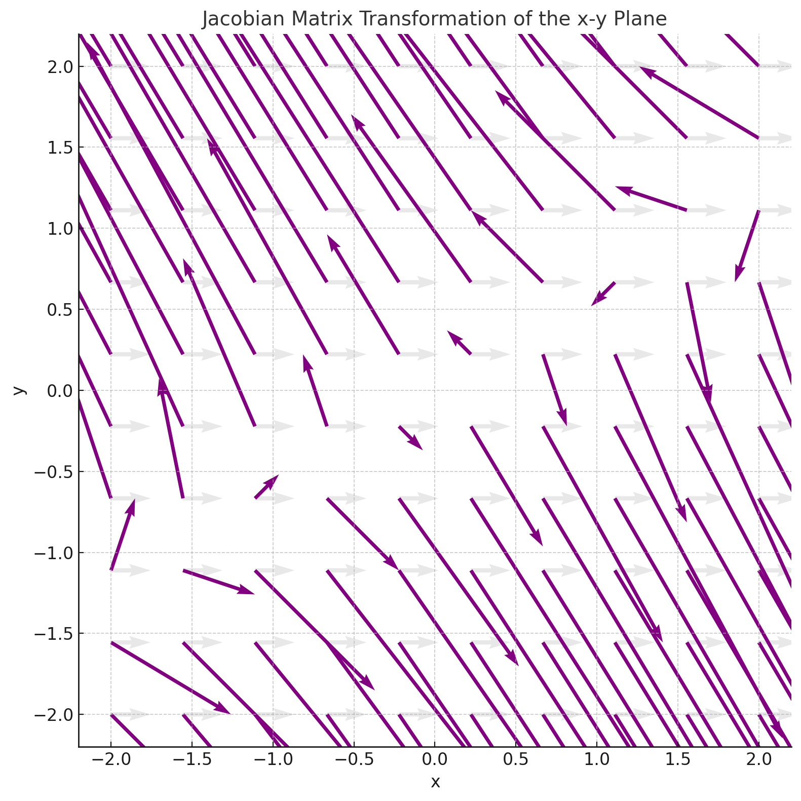

## 📌 What Is the Jacobian?

The **Jacobian** is one of the most important applications of **partial derivatives** in multivariable calculus.

It tells us:
- How a function changes as its inputs change
- The **direction** of steepest ascent (like a slope vector)
- How to generalize derivatives for functions with multiple variables

---

  
📚 <strong>This post is part of the "Intro to Calculus" series</strong>

  
🔙 <strong>Previously:</strong> <a href="/posts/chain-rule-and-partials/" style="color:#FF6F61;">Chain Rule, Implicit Differentiation, and Partial Derivatives (Calculus for ML)</a>
 
    
🔜 <strong>Next:</strong> <a href="/posts/hessien-optimization/" style="color:#1E90FF;">What is the Hessian? Understanding Curvature and Optimization in Machine Learning</a>
 

---
## 🔢 Jacobian of a Scalar Function

Suppose you have a scalar function like:

\\[
f(x, y, z) = x^2 y + 3z
\\]

To find the **Jacobian vector**, you take the partial derivative of \\( f \\) with respect to each variable:

### ✅ Step-by-Step

\\[
\frac{\partial f}{\partial x} = 2xy \quad
\frac{\partial f}{\partial y} = x^2 \quad
\frac{\partial f}{\partial z} = 3
\\]

So, the **Jacobian vector** (i.e., the gradient of f) is:

\\[
\mathbf{J} = [2xy,\ x^2,\ 3]
\\]

A 3D plot showing the function \( f(x,y,z) = x^2 y + 3z \), with arrows (vectors) drawn at a few points, pointing in the direction of the gradient. Use one red arrow labeled “Jacobian” pointing toward a steeper slope.

---

## 🧠 Geometric Interpretation (2D & 3D)

Imagine a function like:

\\[
f(x, y) = e^{-(x^2 + y^2)}
\\]

This looks like a **hill** in 3D — tallest at the center (0, 0), lower as you move out.

Let’s find the **Jacobian at specific points**.

### ▶ At point \\( (-1, 1) \\):

\\[
\frac{\partial f}{\partial x} = -2x e^{-(x^2 + y^2)} = -2(-1) e^{-2} ≈ 0.27 \\
\frac{\partial f}{\partial y} = -2y e^{-(x^2 + y^2)} = -2(1) e^{-2} ≈ -0.27 \\
\Rightarrow \mathbf{J}_{(-1, 1)} ≈ [0.27,\ -0.27]
\\]

### ▶ At point \\( (0, 0) \\):

\\[
\frac{\partial f}{\partial x} = 0 \quad \frac{\partial f}{\partial y} = 0 \Rightarrow \mathbf{J}_{(0, 0)} = [0,\ 0]
\\]

✅ **Interpretation**:
- At the center (0,0), the slope is flat (Jacobian = 0).
- At (-1,1), the vector points **from lower to higher elevation** — steepest path upward.

A 3D “bell-shaped” surface plot of \\( f(x, y) = e^{-(x^2 + y^2)} \\) with vectors shown at (-1,1) and (0,0). The (-1,1) point shows a diagonal vector pointing up-right. Label that vector as "Jacobian ≈ [0.27, -0.27]". At (0,0), show a flat point with a “Jacobian = 0” label.

 = e^{-(x² + y²)} at key points")

---

## 🔁 Jacobian of a Vector-Valued Function (Matrix Form)

When your function returns **multiple outputs**, the Jacobian becomes a **matrix**.

Suppose:

\\[
u(x, y) = x - 2y \\]

\\[v(x, y) = 3y - 2x
\\]

You want the **Jacobian matrix** \\( J(x, y) \\), where:

\\[
J =
\begin{bmatrix}
\frac{\partial u}{\partial x} & \frac{\partial u}{\partial y} \\
\frac{\partial v}{\partial x} & \frac{\partial v}{\partial y}
\end{bmatrix}
\\]

### ✅ Solving:

- \\( \frac{\partial u}{\partial x} = 1 \quad \frac{\partial u}{\partial y} = -2 \\)
- \\( \frac{\partial v}{\partial x} = -2 \quad \frac{\partial v}{\partial y} = 3 \\)

So:

\\[
J(x, y) =
\begin{bmatrix}
1 & -2 \\
-2 & 3
\end{bmatrix}
\\]

✅ This matrix tells how the output vector \\( [u(x,y),\ v(x,y)] \\) changes with small changes in \\( x, y \\).

---

## 🤖 Relevance to Machine Learning

The Jacobian plays a major role in many ML and deep learning workflows:

<ul>
  <li>
    <b>Gradient-Based Optimization</b>: Jacobians are used in calculating gradients during training (e.g., gradient descent).
  </li>
  <li>
    <b>Backpropagation</b>: In neural networks, the chain rule involves Jacobians to propagate errors layer by layer.
  </li>
  <li>
    <b>Feature Sensitivity</b>: Jacobians help us understand how sensitive outputs are to each input variable.
  </li>
  <li>
    <b>Autoencoders & Manifold Learning</b>: Used to study how input spaces are warped/compressed by nonlinear layers.
  </li>
  <li>
    <b>Robustness & Adversarial Attacks</b>: Jacobians help compute perturbations that can fool models.
  </li>
  <li>
    <b>Jacobian Regularization</b>: Some models penalize extreme Jacobians to improve generalization or smoothness.
  </li>
</ul>

---

🧠 Level Up

<ul>
  <li>💥 <b>Multivariate Chain Rule</b>: Jacobians are essential for combining nested vector functions.</li>
  <li>🧠 <b>Neural Networks</b>: Jacobians appear during backpropagation and sensitivity analysis.</li>
  <li>📈 <b>Optimization</b>: The Jacobian is key in gradient descent, Newton’s method, and convergence analysis.</li>
  <li>🧮 <b>Change of Variables in Integrals</b>: Jacobian determinants appear when switching coordinate systems (e.g., Cartesian to polar).</li>
  <li>🎯 <b>Jacobian Determinant</b>: If the determinant ≠ 0, the transformation is locally invertible (used in system stability and transformations).</li>
</ul>

---

<strong>✅ Best Practices</strong>

<ul><li> 📊 <b>Always check your function type</b>: Is it scalar → vector Jacobian? Or vector → matrix Jacobian?</li>
<li> 🔁 <b>Use partial derivatives systematically</b>: Label each one carefully and check dimensions.</li>
<li> 🧠 <b>Visualize in 2D or 3D</b>: Understand what the Jacobian vector/matrix tells you about direction and magnitude.</li>
<li> 🧮 <b>Evaluate at specific points</b>: If analyzing behavior locally, plug in real numbers.</li>
<li> 🧰 <b>Use symbolic tools</b>: Use Python (`sympy`), WolframAlpha, or MATLAB to verify partials.</li>
<li> 📐 <b>Think geometry</b>: Jacobian vectors point uphill. Jacobian matrices bend space.</li></ul>

---

<strong>⚠️ Common Pitfalls</strong>

<ul><li> ❌ <b>Confusing gradient with output</b>: The Jacobian of a scalar function is a **vector</b>, not a scalar.</li>
<li> ❌ <b>Mixing vector and matrix Jacobians</b>: Scalar-valued functions → vector (gradient), vector-valued functions → matrix.</li>
<li> ❌ <b>Skipping zero derivatives</b>: Even if a variable doesn’t show up in one term, still compute its partial.</li>
<li> ❌ <b>Forgetting evaluation point</b>: The Jacobian changes depending on where you evaluate it. Don't treat it as constant.</li>
<li> ❌ <b>Ignoring visualization</b>: Without imagining the geometry (direction/slope), it's easy to lose intuition.</li> </ul>

---

## 📌 Try It Yourself

📊 <strong>Vector Jacobian:</strong> What is the Jacobian vector for 
\( f(x, y, z) = \sin(xy) + z^2 \) ?

🧠 Step-by-step: 
- \( \frac{\partial f}{\partial x} = y \cdot \cos(xy) \) 
- \( \frac{\partial f}{\partial y} = x \cdot \cos(xy) \) 
- \( \frac{\partial f}{\partial z} = 2z \) 

 ✅ Final Answer:
\[
\mathbf{J} = [y \cos(xy),\ x \cos(xy),\ 2z]
\]

---

📊 <strong>Evaluate at a Point:</strong> Find the Jacobian of 
\( f(x, y) = \ln(x^2 + y^2) \) at \( (1, 2) \)

🧠 Step-by-step: 
- \( \frac{\partial f}{\partial x} = \frac{2x}{x^2 + y^2} \) 
- \( \frac{\partial f}{\partial y} = \frac{2y}{x^2 + y^2} \)

At \( (1, 2) \), the denominator becomes \( 1 + 4 = 5 \) 

 ✅ Final Answer:
\[
\mathbf{J}_{(1,2)} = \left[ \frac{2}{5},\ \frac{4}{5} \right]
\]

---

📊 <strong>Jacobian Matrix:</strong> Given:
  \( u(x, y) = x^2 + y \),  
  \( v(x, y) = y^2 - x \),  
find the Jacobian matrix \( J(x, y) \).

🧠 Step-by-step: 

- \( \frac{\partial u}{\partial x} = 2x \),  
  \( \frac{\partial u}{\partial y} = 1 \) 
- \( \frac{\partial v}{\partial x} = -1 \),  
  \( \frac{\partial v}{\partial y} = 2y \)  

 

 ✅ Final Answer:
\[
J(x, y) =
\begin{bmatrix}
2x & 1 \\
-1 & 2y
\end{bmatrix}
\]

---

📊 <strong>Visual Thinking:</strong> Sketch or imagine the surface of  
\( f(x, y) = x^2 - y^2 \)

🧠 Hint: 
This is a <b>saddle surface</b> — increasing in one direction, decreasing in another.

- The Jacobian vector at any point will point toward the direction of <b>steepest increase</b>.
- Try visualizing a vector field where arrows point in the gradient direction.

✍️ Try plotting a few gradient vectors by hand or in Python!

---

## ✅ Summary

Let’s wrap up the key points about Jacobians:

---

<table>
  <thead>
    <tr>
      <th>Topic</th>
      <th>Summary</th>
    </tr>
  </thead>
  <tbody>
    <tr>
      <td>Jacobian of scalar function</td>
      <td><b>Vector</b> of partial derivatives → shows steepest ascent direction</td>
    </tr>
    <tr>
      <td>Jacobian of vector-valued function</td>
      <td><b>Matrix</b> of partials → tracks how multiple outputs change with inputs</td>
    </tr>
    <tr>
      <td>Geometric meaning</td>
      <td>Vectors point from low to high regions — visualize slope</td>
    </tr>
    <tr>
      <td>Matrix transformation</td>
      <td>Jacobian matrix stretches, rotates, or compresses space locally</td>
    </tr>
    <tr>
      <td>In machine learning</td>
      <td>Used in <b>gradient descent</b>, <b>backpropagation</b>, and feature sensitivity</td>
    </tr>
  </tbody>
</table>

---

🧠 <b>Mastering Jacobians gives you the tools to understand direction, scale, and curvature in multivariable systems — essential for modern ML models.</b>
 a comment below — I’d love to hear your thoughts or help if something was unclear.

---
## 🧭 Next Up

Now that you’ve learned how to construct and interpret the Jacobian, you're ready for the next step in multivariable calculus and machine learning: <b>Optimization</b>.

In the upcoming post, we’ll explore:
- How to find <b>critical points</b> using gradients and Hessians
- The role of <b>Jacobian and gradient descent</b> in training ML models
- Visual intuition behind <b>minima, maxima, and saddle points</b>
- How optimization shapes <b>neural networks, regression, and clustering</b>

Stay sharp — you’re about to enter the engine room of how machines learn.

---
## 📺 Explore the Channel

  
  

  <h3 style="margin-top: 16px; color: #333;">🎥 Hoda Osama AI</h3>
  
Learn statistics and machine learning concepts step by step with visuals and real examples.

  
  <a href="https://www.youtube.com/@Hoda_Osama_AI" target="_blank" rel="noopener noreferrer">
    <button style="margin-top: 12px; padding: 10px 20px; font-size: 16px; background-color: #FF0000; color: white; border: none; border-radius: 6px; cursor: pointer;">
      🔔 Subscribe on YouTube
    </button>
  </a>

---

## 💬  Got a Question? 

Leave a comment or open an issue on GitHub — I love connecting with other learners and builders. 🔁
