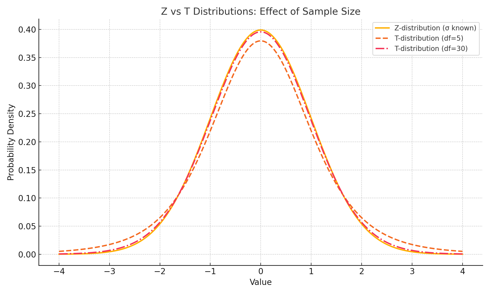

## 🎯 <span style="color:#2E8B57;">Goal: Estimating a Population Mean with Unknown Standard Deviation</span>

When we **don't know the population standard deviation (\\( \sigma \\))**, we rely on the **sample standard deviation (\\( s \\))** instead.

In such cases, we use the **t-distribution**, not the Z-distribution.

---

<div class="series-nav">
  <p>📚 <strong>This post is part of the "Intro to Calculus" series</strong></p>
  <p>🔙 <strong>Previously:</strong> <a href="/posts/Confidence-Interval/" style="color:#FF6F61;">Confidence Interval for a Known Population Standard Deviation</a></p> 
   <p>🔜 <strong>Next:</strong> <a href="/posts/Confidence-Interval-population-proportion/" style="color:#1E90FF;">Confidence Interval for a Population Proportion — Step-by-Step Guide</a></p>
</div>

---

## ☕ <span style="color:#C0392B;">Real-World Case: Coffee Consumption Among Remote Workers</span>

Imagine you’re studying how much coffee remote developers drink daily. You gather data from a **random sample of 25 developers** and calculate:

- **Sample Mean**: \\( \bar{x} = 3.8 \\) cups/day  
- **Sample Standard Deviation**: \\( s = 1.1 \\) cups  
- **Sample Size**: \\( n = 25 \\)  
- **Confidence Level**: 95% (t-critical value for \\( df = 24 \\) is \\( t_{0.025} \approx 2.064 \\))

---

## 📊 <span style="color:#1E90FF;">Step-by-Step: Building the Confidence Interval (T-Distribution)</span>

### 🔹 Step 1: Calculate the Standard Error

\\[
SE = \frac{s}{\sqrt{n}} = \frac{1.1}{\sqrt{25}} = 0.22
\\]

---

### 🔹 Step 2: Find the Margin of Error

\\[
ME = t \times SE = 2.064 \times 0.22 \approx 0.454
\\]

---

### 🔹 Step 3: Construct the Confidence Interval

\\[
\bar{x} \pm ME = 3.8 \pm 0.454
\\]

- **Lower Bound**: \\( 3.8 - 0.454 = 3.35 \\)  
- **Upper Bound**: \\( 3.8 + 0.454 = 4.25 \\)

✅ **Conclusion**: We are 95% confident that **average coffee consumption** among remote developers is between **3.35 and 4.25 cups/day**.

---

## 🧠 Visual Insight: Why Use the T-Distribution?



> When sample sizes are small, the **T-distribution is wider** than the Z-distribution — reflecting **greater uncertainty**.  
> As sample size increases (and degrees of freedom rise), the T-distribution **converges** toward the Z-distribution.  
> This is why we use T when **σ is unknown** and rely on **sample SD**.

---

## 🧠 <span style="color:#D35400;">Level Up: Why This Matters for Machine Learning</span>

In ML, your data is often a sample from a larger unknown population.

- ⚖️ When model performance varies across subgroups, you need **confidence intervals** to **quantify uncertainty**.
- 🧪 In A/B testing or model benchmarking, if the **standard deviation is unknown**, the **T-distribution** helps you generalize correctly from sample data.

📈 Understanding this concept sharpens your ability to evaluate models statistically — especially in cases where your dataset is **small or imbalanced**.

---

## 🧠 Why These Formulas Work: Intuition Behind SE and T

> The formula for **standard error**:
>
 \[
   \\(SE = \frac{s}{\sqrt{n}}\\)
 \]
>
> tells us **how much the sample mean is expected to vary** from one random sample to another.
>
> - Dividing by \\( \sqrt{n} \\) reflects the idea that **larger samples are more stable**.
> - As \\( n \\) increases, your sample mean gets closer to the true mean — which **shrinks the SE** and narrows the confidence interval.
>
> The **t-critical value** accounts for **extra uncertainty** when we **don’t know the population standard deviation (\\( \sigma \\))**.
>
> - With small samples (low degrees of freedom), the **T-distribution is wider** than the Z-distribution.
> - That’s why the **margin of error is larger** — it's protecting you from overconfidence when data is scarce.
>
> 🧠 In essence, this math adjusts for the **fact that your estimate is shakier** when you have less data or less certainty.

---

## 🐍 <span style="color:#8A2BE2;">Python in Practice: CI with Unknown Standard Deviation (T-Distribution)</span>

```python
import numpy as np
import scipy.stats as stats

# Given
sample_mean = 3.8
sample_std = 1.1
n = 25
df = n - 1
t_critical = stats.t.ppf(1 - 0.025, df)

# Standard Error
se = sample_std / np.sqrt(n)

# Margin of Error
me = t_critical * se

# Confidence Interval
ci_lower = sample_mean - me
ci_upper = sample_mean + me

print(f"95% CI: ({ci_lower:.2f}, {ci_upper:.2f})")

```

## 📏 <span style="color:#DC143C;">Quick Reference: Steps to Calculate</span>

| Component                     | Formula                             | Value        |
| ----------------------------- | ----------------------------------- | ------------ |
| Sample Mean (\\( \bar{x} \\)) | —                                   | 3.8 cups     |
| Sample SD (\\( s \\))         | —                                   | 1.1 cups     |
| Sample Size (\\( n \\))       | —                                   | 25           |
| Degrees of Freedom            | \\( n - 1 \\)                       | 24           |
| t-critical (95%)              | \\( t_{0.025,24} \\approx 2.064 \\) | —            |
| Standard Error                | \\( \frac{s}{\sqrt{n}} \\)          | 0.22         |
| Margin of Error               | \\( t \times SE \\)                 | 0.454        |
| CI                            | \\( \bar{x} \pm ME \\)              | (3.35, 4.25) |

---
<details class="custom-box custom-best">
  <summary><strong>✅ Best Practices for T-Based Confidence Intervals</strong></summary>

  <ul>
    <li>📚 <b>Always use the T-distribution when</b> 
      \[
        (\sigma)
      \]
      <b>is unknown</b>
    </li>

    <li>📈 <b>Report degrees of freedom (n − 1)</b> for transparency</li>

    <li>👥 <b>Use sufficiently large samples (n &gt; 30)</b> to better approximate normality</li>

    <li>📉 <b>Check data symmetry</b> — the T-distribution assumes the sample is roughly normal</li>

    <li>🧾 <b>Always report both the point estimate and the confidence interval range</b></li>
  </ul>
</details>

---

<details class="custom-box custom-warning">
  <summary><strong>⚠ Common Pitfalls</strong></summary>

  <ul>
    <li>🚫 <b>Using the Z-distribution when</b> σ <b>is unknown</b></li>

    <li>🔁 <b>Forgetting degrees of freedom</b> when looking up critical t-values</li>

    <li>😬 <b>Assuming small samples are normally distributed</b> without checking</li>

    <li>📉 <b>Ignoring skewness or outliers</b> — the T-distribution is sensitive when n is small</li>

    <li>🤔 <b>Confusing confidence intervals with probability</b> — CI reflects 
      <b>method reliability</b>, not certainty about a single estimate
    </li>
  </ul>
</details>

---

<details class="level-up-box">
  <summary class="level-up-title">🧠 Level Up: When to Switch from T to Z</summary>

  <div class="level-up-content">
    <ul>
      <li>
        <b>Use the Z-distribution when:</b>
        <ul>
          <li>Population standard deviation (σ) is known</li>
          <li>Sample size is large (n &gt; 30) and the Central Limit Theorem applies</li>
        </ul>
      </li>

      <li>
        <b>Use the T-distribution when:</b>
        <ul>
          <li>σ is unknown and estimated using the sample standard deviation</li>
          <li>You are working with small samples (n &lt; 30)</li>
        </ul>
      </li>
    </ul>

    <p><b>In practice:</b> You will almost always use the T-distribution — Z is a special theoretical case.</p>
  </div>
</details>


<h2 id="quiz" class="mt-5">📌 Try It Yourself: T-Interval Confidence Quiz</h2>

**Q1:** When should you use the T-distribution instead of Z?  
<details><summary>💡 Show Answer</summary>When the population standard deviation is **unknown**.</details>

**Q2:** What's the standard error formula when using sample SD?  
<details><summary>💡 Show Answer</summary> 

\[
   ( SE = \\frac{s}{\\sqrt{n}} \\)
\] 

</details>

**Q3:** Why is “degrees of freedom” used in the t-distribution?  
<details><summary>💡 Show Answer</summary>Because we estimate the variance from the sample, so we lose 1 degree of freedom.</details>

**Q4:** Does increasing the sample size reduce the margin of error?  
<details><summary>💡 Show Answer</summary>Yes — increasing \[ ( n ) \] reduces SE, which tightens the confidence interval.</details>

---

## 🔜 <span style="color:#FFA500;">What’s Next?</span>

In the next post, we’ll explore **how to compare two population means** using **two-sample T-tests** — crucial for **A/B testing and hypothesis evaluation** in machine learning.


---
## 📺 Explore the Channel

<div style="max-width: 400px; margin: 30px auto; border: 1px solid #ccc; border-radius: 12px; padding: 16px; box-shadow: 0 2px 8px rgba(0,0,0,0.1); text-align: center; font-family: sans-serif;">
  
  

  <h3 style="margin-top: 16px; color: #333;">🎥 Hoda Osama AI</h3>
  <p style="color: #555;">Learn statistics and machine learning concepts step by step with visuals and real examples.</p>
  
  <a href="https://www.youtube.com/@Hoda_Osama_AI" target="_blank" rel="noopener noreferrer">
    <button style="margin-top: 12px; padding: 10px 20px; font-size: 16px; background-color: #FF0000; color: white; border: none; border-radius: 6px; cursor: pointer;">
      🔔 Subscribe on YouTube
    </button>
  </a>

</div>

---

## 💬 <span style="color:#4B0082;"> Got a Question? </span>

Leave a comment or open an issue on GitHub — I love connecting with other learners and builders. 🔁
