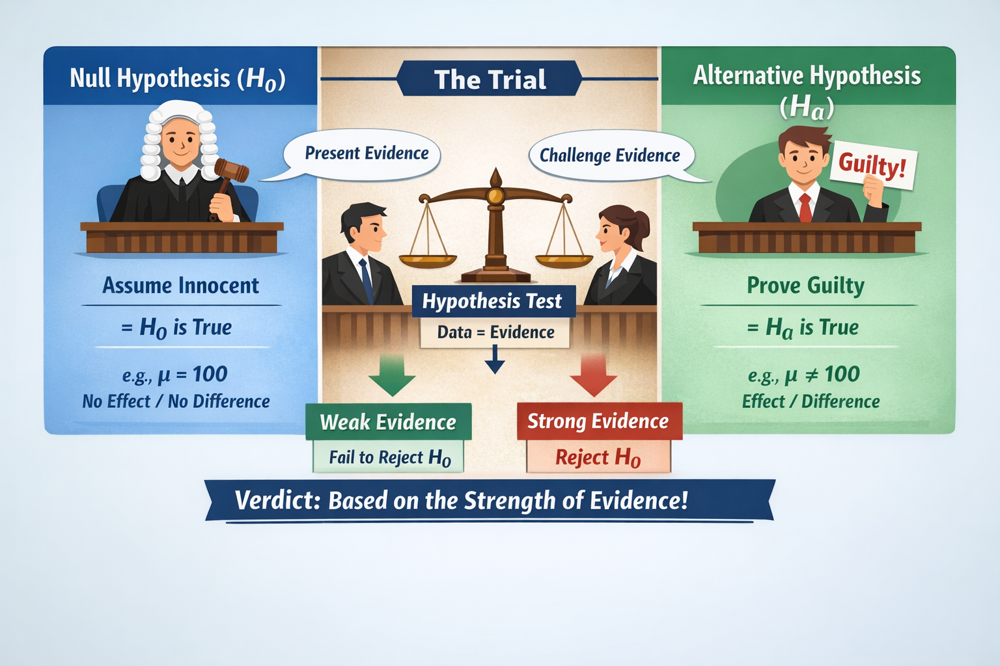

# 📊 Statistical Hypotheses: The Foundation of Significance Testing

This post introduces **Statistical Hypotheses**, the starting point for **Significance Testing** in inferential statistics. You’ll learn how to:
- Formulate null and alternative hypotheses.
- Understand the logic behind testing them.
- Apply real-world examples from tech and data scenarios.

The **courtroom analogy** makes it clear: we assume innocence (the null hypothesis $H_0$) until evidence supports a different claim (the alternative hypothesis $H_a$).

---

## 🔍 Main Concepts

### What is a Hypothesis?
A **statistical hypothesis** is a claim or assumption about a population parameter — typically a **mean (μ)** or **proportion (p)**.

### Types of Hypotheses:
- **Null Hypothesis ($H_0$)**: The default assumption. States that there is no effect or no difference (e.g., $p = 0.25$).
- **Alternative Hypothesis ($H_a$)**: What you’re trying to support — that there **is** an effect or difference (e.g., $p > 0.25$).
- They are **mutually exclusive**: only one can be true.

---

## ⚖️ The Courtroom Analogy

- **$H_0$ = Innocent** until proven guilty.
- **Data = Evidence**. The trial tests whether evidence strongly contradicts $H_0$.
- If the evidence is weak: we **fail to reject $H_0$**.
- If the evidence is strong: we **reject $H_0$ in favor of $H_a$**.

---

---

## 🧪 Real-World Examples (Updated)

### 📈 Example 1: Click-Through Rate (Proportion)

**Scenario:**  
A data analyst wants to test whether the new homepage design increases click-through rates above the current benchmark of 25%.

- Null Hypothesis ($H_0$): $p = 0.25$  
- Alternative Hypothesis ($H_a$): $p > 0.25$  
- Type: **One-tailed proportion test**

If a random sample of 200 users shows that 64 clicked (click rate = 0.32), this test can determine if the difference is statistically significant or due to chance.

---

### 🧠 Example 2: Server Response Time (Mean)

**Scenario:**  
An ML engineer suspects that a new backend model slows response time compared to the current standard of 120ms.

- Null Hypothesis ($H_0$): $\mu = 120$  
- Alternative Hypothesis ($H_a$): $\mu > 120$  
- Type: **One-tailed mean test**

A sample of 40 responses from the new model shows a mean of 127.5ms with a standard deviation of 15ms. Is this increase significant?

---

## ✅ Practical Plan: How to Formulate a Hypothesis Test

### 🔹 Phase 1: Define Your Claim
- [ ] Identify the Parameter: Are you testing a mean (μ) or a proportion (p)?
- [ ] Define $H_a$: What outcome do you want to support? Use inequalities ($<, >, 
eq$).

### 🔹 Phase 2: Set the Baseline
- [ ] Define $H_0$: This is the claim of "no change", always using equality.

### 🔹 Phase 3: Conduct the Test
- [ ] Collect sample data.
- [ ] Analyze: Does the evidence contradict $H_0$ strongly enough?
- [ ] Conclude: Reject $H_0$ only if results are statistically significant.

> ⚠️ Important: If results are not significant, you **do not confirm $H_0$ is true** — you only “fail to reject” it due to insufficient evidence.

---

  
<strong>✅ Best Practices for Hypothesis Testing</strong>

  <ul>
    <li>📚 <b>Always define both</b> $H_0$ <b>and</b> $H_a$ <b>clearly before collecting data</b></li>
    <li>🎯 <b>Use one-tailed tests only</b> when your research question has a clear direction (e.g., $H_a$: $p > 0.3$)</li>
    <li>📊 <b>Select the appropriate test:</b> Use Z-tests for proportions and T-tests for means with unknown σ</li>
    <li>📈 <b>Report the p-value</b> and compare it with a significance level (usually 0.05)</li>
    <li>🧪 <b>Include context for your conclusion:</b> explain practical implications of rejecting or not rejecting $H_0$</li>
  </ul>

---

  
<strong>⚠ Common Pitfalls in Hypothesis Testing</strong>

  <ul>
    <li>🚫 <b>Failing to define hypotheses properly</b> before analyzing the data</li>
    <li>❌ <b>Using a one-tailed test when a two-tailed test is required</b></li>
    <li>😬 <b>Misinterpreting "fail to reject $H_0$" as proof that $H_0$ is true</b></li>
    <li>🔍 <b>Ignoring assumptions</b> such as sample independence or normality (for T-tests)</li>
    <li>📉 <b>Basing conclusions on anecdotal or biased samples</b></li>
  </ul>

---

  
🧠 Level-Up: One-Tailed vs. Two-Tailed Tests

  

    <ul>
      <li>
        <b>One-Tailed Test:</b> Use when your alternative hypothesis points in a specific direction:
        <ul>
          <li>e.g., $H_a$: $\mu > 100$ or $p < 0.3$</li>
        </ul>
      </li>
      <li>
        <b>Two-Tailed Test:</b> Use when you're testing for any difference (no specific direction):
        <ul>
          <li>e.g., $H_a$: $\mu 
eq 100$</li>
        </ul>
      </li>
    </ul>

    
<b>Tip:</b> When in doubt, choose the two-tailed test — it's more conservative and widely used in scientific research.

  

---

  
<strong>🧬 Why It Matters to Machine Learning</strong>

  <ul>
    <li>🤖 <b>Model Validation:</b> Hypothesis testing helps verify if performance improvements are statistically significant</li>
    <li>🧪 <b>A/B Testing:</b> Common in ML product pipelines for comparing models, interfaces, or features</li>
    <li>🧠 <b>Bias Detection:</b> You can test if certain metrics differ across subgroups (e.g., fairness audits)</li>
    <li>📊 <b>Statistical significance</b> provides evidence that generalizes beyond training data</li>
    <li>⚙️ <b>Noise Filtering:</b> Helps avoid overreacting to random performance fluctuations</li>
  </ul>

---

<h2 id="quiz" class="mt-5">📌 Try It Yourself: Hypothesis Testing Quiz</h2>

**Q1:** What is the null hypothesis in a significance test?  

💡 Show Answer
The default assumption that there's no effect or no difference in the population.

**Q2:** Which hypothesis do we try to find evidence for?  

💡 Show Answer
The alternative hypothesis ($H_a$).

**Q3:** If you fail to reject the null hypothesis, what does it mean?  

💡 Show Answer
There wasn't enough evidence to support the alternative; we keep $H_0$.

**Q4:** When do you use a T-test instead of a Z-test?  

💡 Show Answer
When the population standard deviation is unknown and you're testing a mean.

**Q5:** What does "statistically significant" mean in hypothesis testing?  

💡 Show Answer
The result is unlikely to have occurred by random chance alone under the null hypothesis.

---

## 📝 Final Summary

- Hypothesis testing is a fundamental part of inferential statistics.
- It starts with a **null hypothesis ($H_0$)** that represents the status quo.
- You test sample data to determine whether there's enough **evidence to reject $H_0$** in favor of an **alternative hypothesis ($H_a$)**.
- Always define your hypotheses **before** collecting data and use the **correct test** depending on whether you’re analyzing means (T-test) or proportions (Z-test).
- In machine learning, hypothesis testing helps validate models, ensure robustness, and support decision-making based on evidence rather than assumptions.

Use these principles to strengthen the credibility of your data insights. 🚀

---
## 📺 Explore the Channel

  
  

  <h3 style="margin-top: 16px; color: #333;">🎥 Hoda Osama AI</h3>
  
Learn statistics and machine learning concepts step by step with visuals and real examples.

  
  <a href="https://www.youtube.com/@Hoda_Osama_AI" target="_blank" rel="noopener noreferrer">
    <button style="margin-top: 12px; padding: 10px 20px; font-size: 16px; background-color: #FF0000; color: white; border: none; border-radius: 6px; cursor: pointer;">
      🔔 Subscribe on YouTube
    </button>
  </a>

---
## 💬  Got a Question? 

Leave a comment or open an issue on GitHub — I love connecting with other learners and builders. 🔁