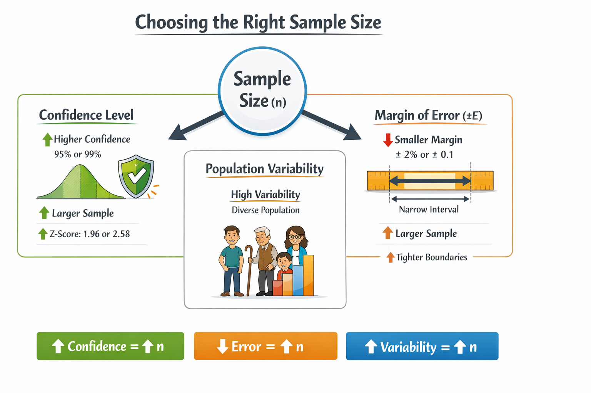

## 🎯 <span style="color:#2E8B57;">Goal: Calculate Minimum Sample Size for Reliable Statistics</span>

You don’t need to collect data from everyone to get meaningful results. By defining how **accurate and confident** you want to be, you can compute a **precise sample size** using just a few inputs.

This lets you avoid:
- Wasting time and money on too many participants 💸
- Getting unreliable results from too few participants 📉

---

## 🔑 <span style="color:#C0392B;">The 3 Key Drivers of Sample Size</span>

To compute the needed sample size \\( n \\), you must define these 3 factors:

| Factor                     | Description                                  | Effect on Sample Size             |
| -------------------------- | -------------------------------------------- | --------------------------------- |
| **Margin of Error (E)**    | How precise your results need to be          | Smaller error = Larger sample     |
| **Confidence Level**       | How sure you want to be (e.g., 95%)          | Higher confidence = Larger sample |
| **Population Variability** | How much variation exists (SD or proportion) | More variation = Larger sample    |

---




---

## ☕ <span style="color:#C0392B;">Case Study 1: Estimating a Mean (Numerical Average)</span>

**Scenario**: You want to estimate how many **hours per week freelancers in Berlin spend in meetings**.

### Inputs:
- Confidence Level: **95%** → Z-score = **1.96**
- Desired Margin of Error (\\( E \\)): **±0.5 hours**
- No known standard deviation, but you estimate the range is from **0 to 8 hours/week**

\\[
\sigma \approx \frac{\text{Range}}{4} = \frac{8}{4} = 2
\\]

### Formula for Mean:
\\[
n = \frac{Z^2 \cdot \sigma^2}{E^2}
\\]

### Plug-in:
\\[
n = \frac{(1.96^2 \cdot 2^2)}{0.5^2} = \frac{(3.8416 \cdot 4)}{0.25} = \frac{15.3664}{0.25} = 61.47
\\]

✅ **Result**: You need at least **62 freelancers**.

---

## 📊 <span style="color:#1E90FF;">Case Study 2: Estimating a Proportion (Yes/No Data)</span>

**Scenario**: You want to estimate what **percentage of people in Tokyo recycle regularly**, and you have no prior estimate.

### Inputs:
- Confidence Level: **99%** → Z-score = **2.58**
- Margin of Error: **±8%** → \\( E = 0.08 \\)
- No prior data → use **\\( p = 0.5 \\)** (safest assumption)

### Formula for Proportion:
\\[
n = \frac{p(1-p) \cdot Z^2}{E^2}
\\]

\\[
n = \frac{(0.5 \cdot 0.5 \cdot 2.58^2)}{0.08^2} = \frac{(0.25 \cdot 6.6564)}{0.0064} \approx 260.6
\\]

✅ **Result**: You need at least **261 participants**.

---

## 🐍 <span style="color:#8A2BE2;">Python in Practice: Sample Size Calculations</span>

```python
import numpy as np

# For estimating a mean
Z_mean = 1.96  # 95% confidence
sigma = 2      # estimated SD from range
E_mean = 0.5   # margin of error
n_mean = (Z_mean**2 * sigma**2) / (E_mean**2)
print(f"Sample size for mean: {np.ceil(n_mean)}")

# For estimating a proportion
Z_prop = 2.58  # 99% confidence
E_prop = 0.08  # margin of error
p = 0.5        # safest guess
n_prop = (p * (1 - p) * Z_prop**2) / (E_prop**2)
print(f"Sample size for proportion: {np.ceil(n_prop)}")
```
### Output:

- Sample size for mean: 62.0.
- Sample size for proportion: 261.0.

---

## 🧠 <span style="color:#DC143C;">Practical Plan: How to Choose Your Sample Size</span>

### ✅ Step 1: Set Your Standards
- **Confidence Level**: 95% (Z = 1.96) or 99% (Z = 2.58)
- **Margin of Error**: How accurate must your result be? ±5% or ±0.5 units?

---

### ✅ Step 2: Estimate Variability
- **For Means**: Use the formula \\( \text{Range} / 4 \\) if you don’t know SD
- **For Proportions**: Use 0.5 if you have no idea — it gives the safest (largest) estimate

---

### ✅ Step 3: Plug Into Formula
- For Means:
\\[
n = \left(\frac{Z \cdot \sigma}{E}\right)^2
\\]

- For Proportions:
\\[
n = \left(\frac{Z}{E}\right)^2 \cdot 0.25
\\]


---

<details class="custom-box custom-best">
  <summary><strong>✅ Best Practices for Sample Size Calculation</strong></summary>

  <ul>
    <li>📊 <b>Use 95% confidence level</b> unless you have a high-risk case requiring 99%</li>
    <li>📏 <b>Choose an appropriate margin of error</b> — tighter estimates require more data</li>
    <li>🔍 <b>Always round sample size up</b> to ensure minimum requirements are met</li>
    <li>📚 <b>Use past studies or estimated ranges</b> to guess standard deviation when needed</li>
    <li>🧠 <b>If no prior percentage is known</b>, assume 50% for safest sample size</li>
  </ul>
</details>

---

<details class="custom-box custom-warning">
  <summary><strong>⚠ Common Pitfalls</strong></summary>

  <ul>
    <li>🚫 <b>Underestimating sample size</b> by using too loose a margin of error or confidence level</li>
    <li>😬 <b>Not accounting for variability</b> — forgetting to estimate standard deviation or using wrong value</li>
    <li>📉 <b>Using the sample size formula for means on binary data</b> (and vice versa)</li>
    <li>🔁 <b>Forgetting to round up</b> — rounding down leads to underpowered studies</li>
    <li>🧾 <b>Skipping documentation</b> — always note your assumptions (SD, p, E, Z)</li>
  </ul>
</details>

---


<details class="level-up-box">
  <summary class="level-up-title">🧠 Level Up: Advanced Sampling Insights</summary>

  <div class="level-up-content">
    <ul>
      <li>🎯 Consider effect size when comparing two groups — smaller differences require larger samples</li>
      <li>🧮 Use pilot studies to estimate standard deviation more accurately</li>
      <li>📈 Don’t forget power analysis — plan for 80–90% power in hypothesis testing</li>
      <li>⚙️ Use online calculators or software (like G*Power) for complex designs</li>
    </ul>
    <p>Understanding advanced drivers of sample size boosts your statistical confidence and helps prevent wasted effort.</p>
  </div>
</details>

---

<details class="level-up-box">
  <summary class="level-up-title">🤖 Why This Matters for Machine Learning</summary>

  <div class="level-up-content">
    <ul>
      <li>📈 <b>Model Evaluation</b>: Ensure test sets are large enough to evaluate model performance reliably</li>
      <li>🔄 <b>A/B Testing</b>: Avoid false positives or false negatives by planning sample sizes ahead of experiments</li>
      <li>🧪 <b>Labeling Strategies</b>: When manually labeling data, use sample size planning to reduce workload while maintaining accuracy</li>
      <li>🔍 <b>Survey-based Features</b>: Plan how many user feedback responses you need for trustworthy features or preferences</li>
    </ul>

    <p>Knowing how many samples to collect improves the <b>efficiency, accuracy, and fairness</b> of your ML workflow — from training to testing to deployment.</p>
  </div>
</details>

---

<h2 id="quiz" class="mt-5">📌 Try It Yourself: Sample Size Quiz</h2>

**Q1:** What happens to required sample size if you want more precision (smaller margin of error)?  
<details><summary>💡 Show Answer</summary>Sample size increases.</details>

**Q2:** What Z-score is used for 99% confidence?  
<details><summary>💡 Show Answer</summary>2.58</details>

**Q3:** If you don’t know the proportion for a yes/no question, what value should you use for p?  
<details><summary>💡 Show Answer</summary>Use 0.5 (50%) — it's the most conservative assumption.</details>

**Q4:** Why should you always round your sample size up?  
<details><summary>💡 Show Answer</summary>To ensure you meet the minimum needed to maintain accuracy.</details>

---

### ✅ Step 4: Round Up
Always round **up** your result. If your calculation returns **261.1**, round up to 262 — that’s your **minimum required sample size** .

---

## 🔜 <span style="color:#FFA500;">What’s Next?</span>

In the next post, we’ll dive into **Finite Population Correction** — how to adjust your sample size when you’re working with small or known populations.

---
## 📺 Explore the Channel

<div style="max-width: 400px; margin: 30px auto; border: 1px solid #ccc; border-radius: 12px; padding: 16px; box-shadow: 0 2px 8px rgba(0,0,0,0.1); text-align: center; font-family: sans-serif;">
  
  

  <h3 style="margin-top: 16px; color: #333;">🎥 Hoda Osama AI</h3>
  <p style="color: #555;">Learn statistics and machine learning concepts step by step with visuals and real examples.</p>
  
  <a href="https://www.youtube.com/@Hoda_Osama_AI" target="_blank" rel="noopener noreferrer">
    <button style="margin-top: 12px; padding: 10px 20px; font-size: 16px; background-color: #FF0000; color: white; border: none; border-radius: 6px; cursor: pointer;">
      🔔 Subscribe on YouTube
    </button>
  </a>
</div>
---
## 💬 <span style="color:#4B0082;"> Got a Question? </span>

Leave a comment or open an issue on GitHub — I love connecting with other learners and builders. 🔁