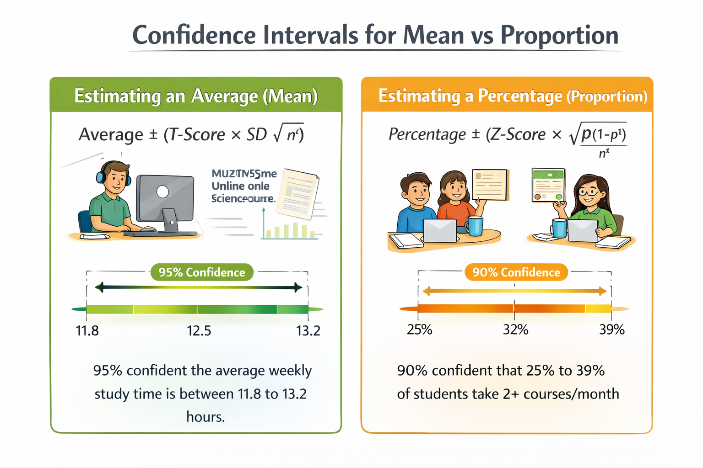

## 🎓 Two Case Studies: Estimating Means and Proportions in Data Science Student

In this comprehensive example, you'll learn how to calculate confidence intervals for two different goals:
- Estimating a **population average (mean)** using the **T-distribution**
- Estimating a **population proportion** using the **Z-distribution**

---

## 📌 Scenario A: Estimating an Average (Mean)

### 🎯 Goal:
Estimate the **average number of hours** Data Science students spend watching online courses weekly.

### 📊 Data:
- Sample Size (\\( n \\)) = 120 students  
- Sample Mean (\\( \bar{x} \\)) = 12.5 hours  
- Sample Standard Deviation (\\( S \\)) = 4.2 hours  
- Confidence Level = 95%

### 🧮 Step-by-Step:

**1. Use T-Distribution** (since we're estimating a mean and \\( \sigma \\) is unknown)

**2. Degrees of Freedom**:
\\[
df = n - 1 = 119
\\]

**3. T-score** for 95% confidence and df = 100 (close to 119):  
\\[
t = 1.984
\\]

**4. Margin of Error (ME)**:
\\[
ME = 1.984 \times \frac{4.2}{\sqrt{120}} \approx 0.76
\\]

**5. Confidence Interval**:
\\[
12.5 \pm 0.76 \Rightarrow [11.74, 13.26]
\\]

✅ **Conclusion**: We are **95% confident** that the average number of hours Data Science students spend on online learning weekly is between **11.74 and 13.26 hours**.

---

## 📌 Scenario B: Estimating a Proportion

### 🎯 Goal:
Estimate the **percentage of Data Science students** who complete more than one course per month.

### 📊 Data:
- Sample Size (\\( n \\)) = 120 students  
- Sample Proportion (\\( \hat{p} \\)) = 0.32 (32%)  
- Confidence Level = 90%

### 🧮 Step-by-Step:

**1. Use Z-Distribution** (proportions always use Z)

**2. Z-score** for 90% confidence:
\\[
z = 1.645
\\]

**3. Standard Error (SE)**:
\\[
SE = \sqrt{\frac{0.32 \cdot 0.68}{120}} \approx 0.043
\\]

**4. Margin of Error (ME)**:
\\[
ME = 1.645 \times 0.043 \approx 0.071
\\]

**5. Confidence Interval**:
\\[
0.32 \pm 0.071 \Rightarrow [0.249, 0.391]
\\]

✅ **Conclusion**: We are **90% confident** that between **24.9% and 39.1%** of Data Science students complete more than one course per month.

---

---

## 🧭 Practical Plan: Choosing the Right Method

Follow this plan anytime you have data and want to estimate population parameters confidently.

---

### ✅ Step 1: Define Your Objective

| Type of Measurement | Go To Step |
| ------------------- | ---------- |
| Average (Mean)      | Step 2A    |
| Percentage          | Step 2B    |

---

### 📏 Step 2A: Estimating a Mean

Use the formula:

\\[
\text{Mean} \pm \left( \text{T-Score} \times \frac{S}{\sqrt{n}} \right)
\\]

- Use \\( df = n - 1 \\) to get your T-score  
- Works best when \\( \sigma \\) is unknown (almost always in real-world data)

---

### 📊 Step 2B: Estimating a Proportion

Use the formula:

\\[
\text{Proportion} \pm \left( Z \times \sqrt{\frac{p(1-p)}{n}} \right)
\\]

- Use Z-scores for your confidence level:
  - 90% → 1.645
  - 95% → 1.96
  - 99% → 2.58

---

### 🧾 Step 3: Communicate the Results

> “We are [Confidence Level]% confident that the true [average/percentage] lies between [lower bound] and [upper bound], based on a sample of [n] participants.”

---

  
<strong>✅ Best Practices for Confidence Intervals</strong>

  <ul>
    <li>🎯 <b>Use the T-distribution when estimating means</b> with unknown population standard deviation (which is almost always the case)</li>
    <li>📐 <b>Use the Z-distribution for proportions</b> since it relies on known sample proportions and large enough n</li>
    <li>🧪 <b>Ensure sample size is large enough</b>: at least 30 for means, and both np and n(1-p) ≥ 15 for proportions</li>
    <li>📈 <b>Always report both the point estimate and the confidence interval</b> for clarity</li>
    <li>🔍 <b>State your confidence level clearly</b> in conclusions: “We are 95% confident that…”</li>
  </ul>

---

  
<strong>⚠ Common Pitfalls</strong>

  <ul>
    <li>🚫 <b>Using Z-distribution for means</b> when population standard deviation is unknown</li>
    <li>😵‍💫 <b>Misinterpreting confidence intervals</b> — it’s about method reliability, not a specific probability</li>
    <li>📉 <b>Failing to check assumptions</b> (normality for small n, np ≥ 15 rule for proportions)</li>
    <li>📉 <b>Using too small a sample size</b> leading to wide, less useful intervals</li>
    <li>🤷 <b>Reporting CI without context</b> (e.g., sample size, confidence level, or what’s being measured)</li>
  </ul>

---

  
🧠 Level-Up: Choosing Between T and Z

  

    <ul>
      <li><b>Use T-distribution when:</b>
        <ul>
          <li>Estimating a mean</li>
          <li>Population standard deviation (σ) is unknown</li>
          <li>Sample size is small (n &lt; 30)</li>
        </ul>
      </li>
      <li><b>Use Z-distribution when:</b>
        <ul>
          <li>Estimating a proportion (e.g., % of users who clicked)</li>
          <li>Sample size is large</li>
        </ul>
      </li>
    </ul>
    
<b>Tip:</b> T is used far more often than Z in real-world analysis involving averages.

  

---

  
<strong>🧬 Why It Matters in Machine Learning</strong>

  <ul>
    <li>📊 <b>Model Evaluation:</b> Confidence intervals help quantify uncertainty in accuracy, precision, recall, etc.</li>
    <li>📉 <b>Generalization:</b> CI offers a way to express how your model might perform on unseen data</li>
    <li>🤖 <b>A/B Testing:</b> CI around click-through rates or conversion proportions guide data-driven product decisions</li>
    <li>⚖️ <b>Bias Detection:</b> Confidence intervals allow comparison across subgroups (e.g., fairness across genders or regions)</li>
  </ul>

---

## 📌 Try It Yourself: Confidence Interval Quiz

**Q1:** When should you use the T-distribution?  

💡 Show Answer
When estimating a <b>mean</b> and the population standard deviation is <b>unknown</b>.

**Q2:** What’s the formula for confidence intervals for proportions?  

💡 Show Answer
  
\[
\hat{p} \pm Z \cdot \sqrt{\frac{\hat{p}(1 - \hat{p})}{n}}
\]

**Q3:** What happens when you increase your confidence level from 95% to 99%?  

💡 Show Answer
The margin of error increases — your interval becomes wider.

**Q4:** What's the difference between T and Z distributions?  

💡 Show Answer
T-distribution is used for small samples and unknown σ, Z is used for large samples and proportions.

---

## 🧾 Summary: Key Takeaways

- ✅ Use **T-distribution** when estimating a **mean** with unknown population standard deviation.
- ✅ Use **Z-distribution** when estimating a **proportion** or when σ is known and sample size is large.
- 🧪 Check sample size: use T only if your sample is reasonably large or data is approximately normal.
- 🎯 Interpret CIs correctly: a 95% confidence interval means the method captures the true value 95% of the time.
- 🔍 Always report the confidence level, the estimate, and the full interval.
- 📊 Real-world data (like study hours or course completion rates) can be analyzed with these tools.
- 🤖 In ML, confidence intervals support robust reporting for metrics, A/B testing, and generalization checks.

> 📘 Use this post as a practical guide every time you work with statistical estimates in your analysis or models.

---
## 📺 Explore the Channel

  
  

  <h3 style="margin-top: 16px; color: #333;">🎥 Hoda Osama AI</h3>
  
Learn statistics and machine learning concepts step by step with visuals and real examples.

  
  <a href="https://www.youtube.com/@Hoda_Osama_AI" target="_blank" rel="noopener noreferrer">
    <button style="margin-top: 12px; padding: 10px 20px; font-size: 16px; background-color: #FF0000; color: white; border: none; border-radius: 6px; cursor: pointer;">
      🔔 Subscribe on YouTube
    </button>
  </a>

---
## 💬  Got a Question? 

Leave a comment or open an issue on GitHub — I love connecting with other learners and builders. 🔁