

  
📌 Explore visual summaries for key <strong>Statistics</strong> & <strong>Machine Learning</strong> concepts.

  
🖼️ Click any infographic to dive into the full lesson with explanations.

  
🎯 Use the filters below to explore by topic and branch of statistics.

<!-- Filter Buttons -->

  <!-- <button onclick="filterInfographics('all')">📚 All</button> -->
  <button onclick="filterInfographics('descriptive')">🟢 Descriptive</button>
  <!-- <button onclick="filterInfographics('inferential')">🔵 Inferential</button>
  <button onclick="filterInfographics('probability')">🟡 Probability</button> -->

<!-- Infographics Grid -->

  <!-- Infographic Card: Inferential -->
  <!-- 

    <a href="/posts/Confidence-Interval-noSTD/">
      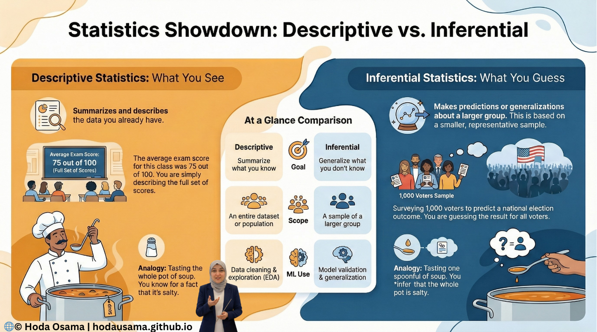
    </a>
    <h3>📊 Confidence Interval (Unknown σ)</h3>
    <a class="btn" href="/posts/Confidence-Interval-noSTD/">Read Lesson</a>
  
 -->

  <!-- Infographic Card: Descriptive -->
  

    
    <h3>📈 Descriptive vs Inferential Statistics</h3>
    <a class="btn" href="/posts/descriptive-vs-inferential/">Read Lesson</a>
  

 

    <a href="/posts/cases-variables-frequency-table/">
      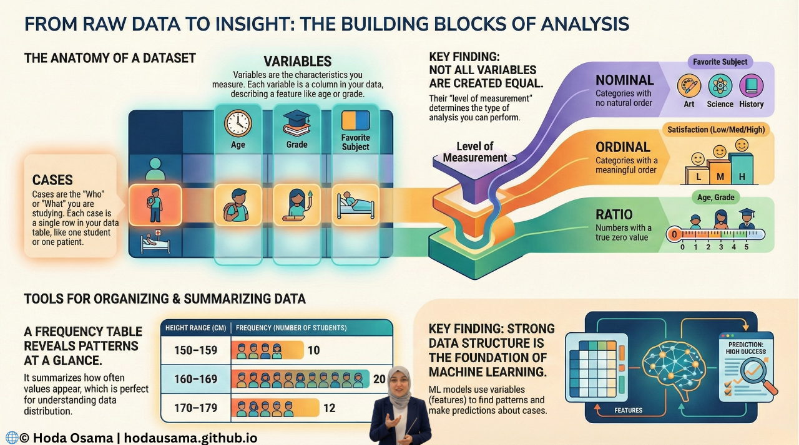
    </a>
    <h3>📈 Cases Variables Frequency Table</h3>
    <a class="btn" href="/posts/cases-variables-frequency-table/">Read Lesson</a>
  

 

    <a href="/posts/graph-types-in-statistics/">
      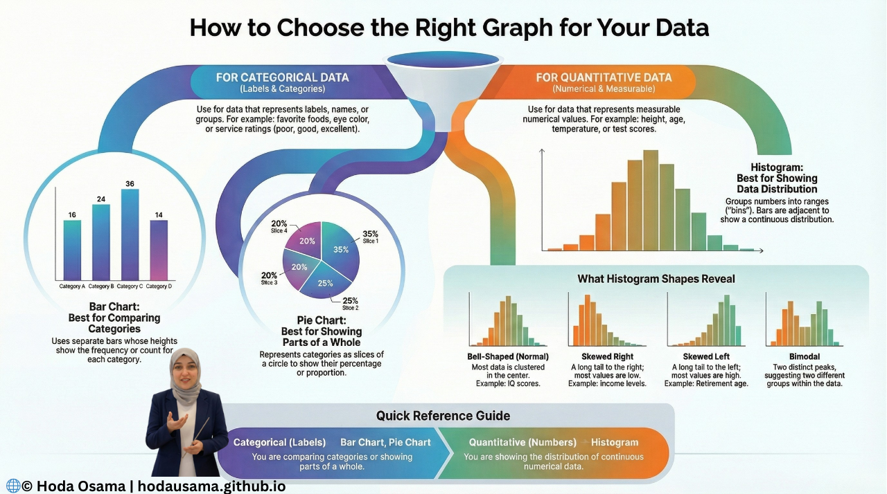
    </a>
    <h3>📈 Graph Types In Statistics</h3>
    <a class="btn" href="/posts/graph-types-in-statistics/">Read Lesson</a>
  

   

    <a href="/posts/frequency-tables-python/">
      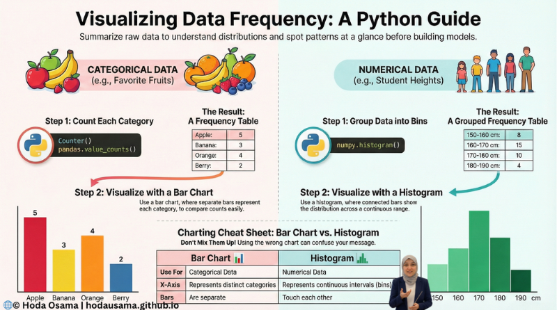
    </a>
    <h3>📈 Frequency Tables Python</h3>
    <a class="btn" href="/posts/frequency-tables-python/">Read Lesson</a>
  

     

    <a href="/posts/central-tendency/">
      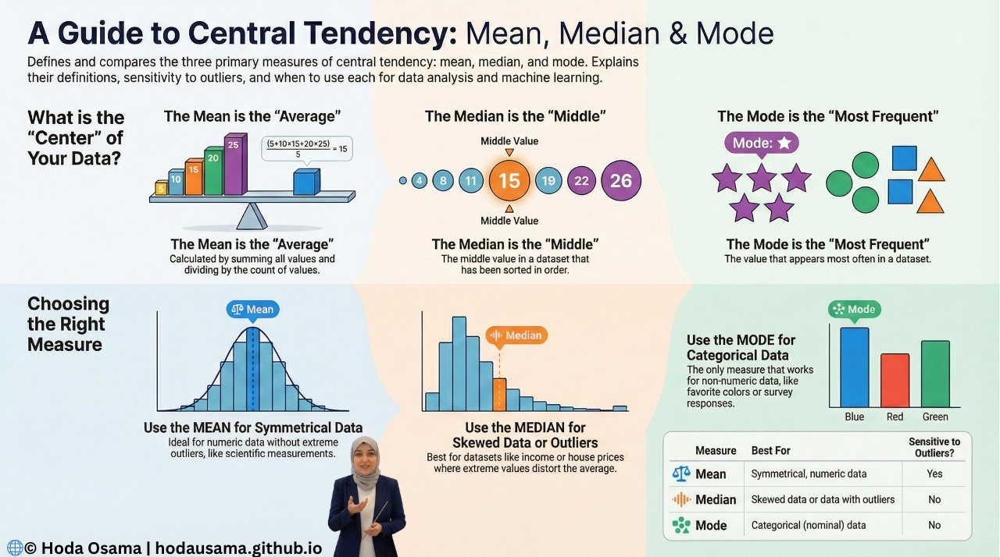
    </a>
    <h3>📈 Central Tendency</h3>
    <a class="btn" href="/posts/central-tendency/">Read Lesson</a>
  

    

    <a href="/posts/dispersion-range-iqr-boxplot/">
      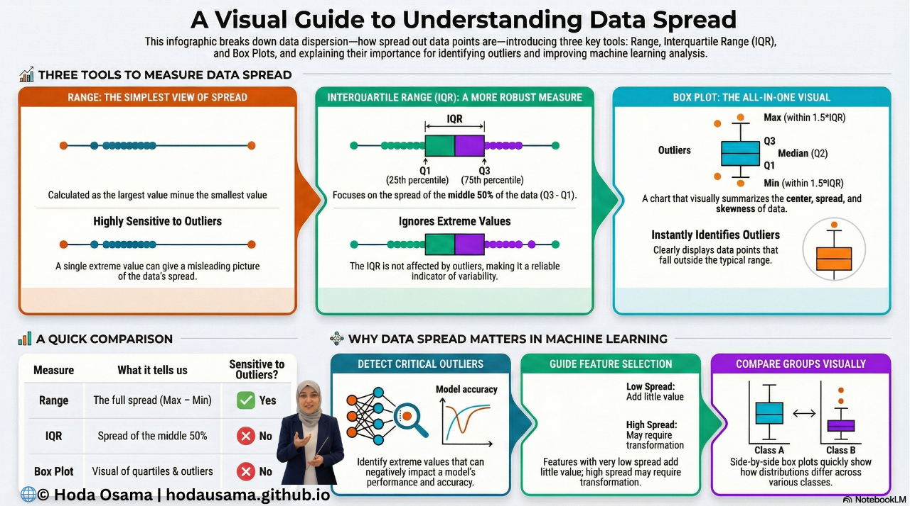
    </a>
    <h3>📈 Range, IQR, and the Box Plot</h3>
    <a class="btn" href="/posts/dispersion-range-iqr-boxplot/">Read Lesson</a>
  

    

    <a href="/posts/z-score-standardization/">
      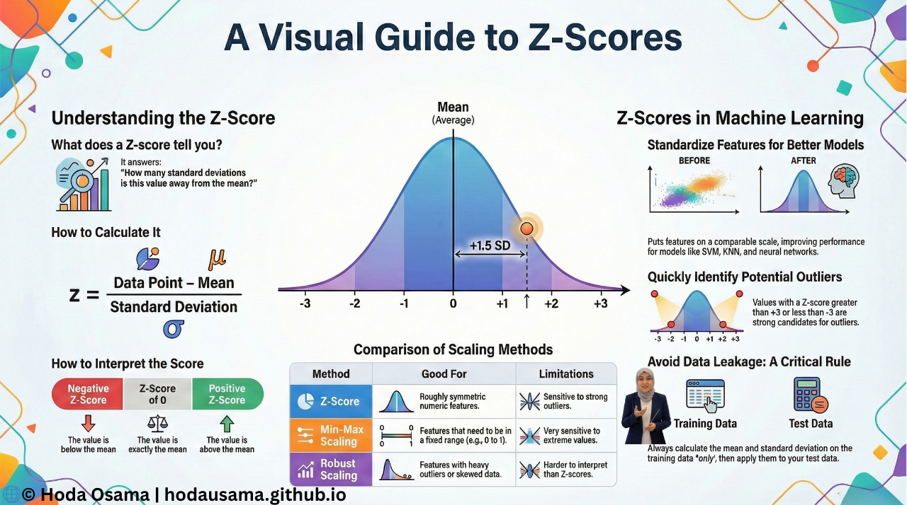
    </a>
    <h3>📈 Z-Score: Comparing Values Using Standardization</h3>
    <a class="btn" href="/posts/z-score-standardization/">Read Lesson</a>
  

 

    <a href="/posts/correlation-contingency-scatter/">
      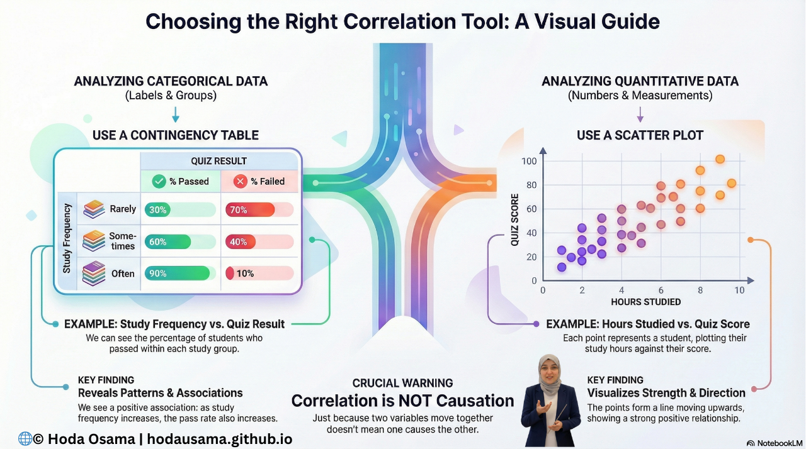
    </a>
    <h3>📈 Contingency Tables and Scatter Plots</h3>
    <a class="btn" href="/posts/correlation-contingency-scatter/">Read Lesson</a>
  

   

    <a href="/posts/PearsonsR/">
      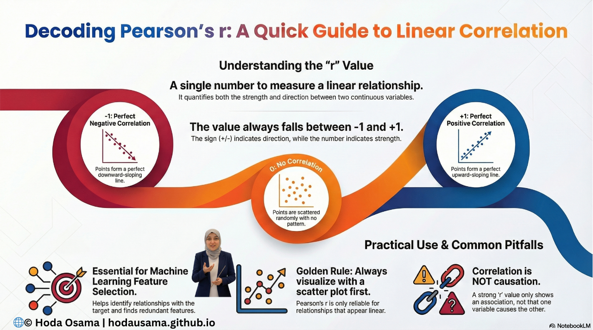
    </a>
    <h3>📈 Pearson’s r</h3>
    <a class="btn" href="/posts/PearsonsR/">Read Lesson</a>
  

    

    <a href="/posts/Regression/">
      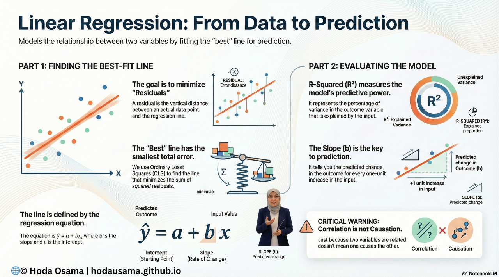
    </a>
    <h3>📈 Regression</h3>
    <a class="btn" href="/posts/Regression/">Read Lesson</a>
  

    

    <a href="/posts/Randomness/">
      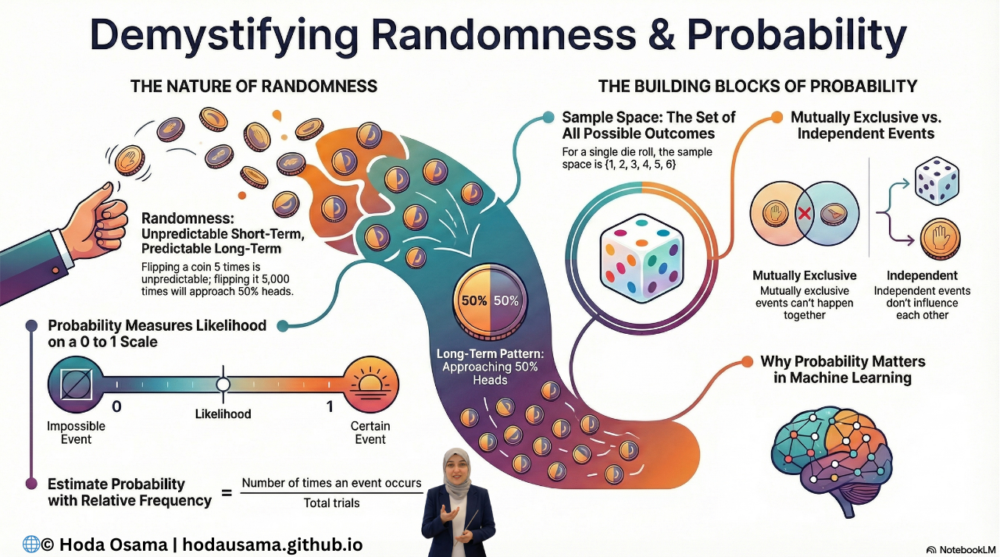
    </a>
    <h3>📈 Randomness</h3>
    <a class="btn" href="/posts/Randomness/">Read Lesson</a>
  

   

    <a href="/posts/union-conditional/">
      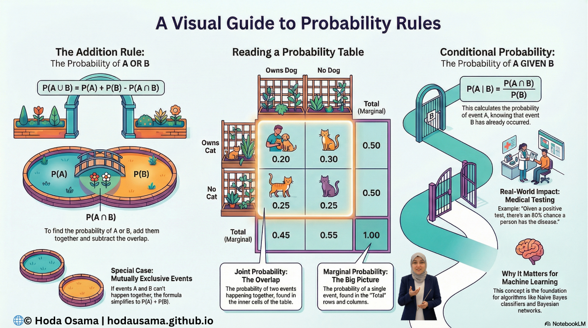
    </a>
    <h3>📈 Making Sense of Probabilities: Union, Tables, and Conditional Thinking</h3>
    <a class="btn" href="/posts/union-conditional/">Read Lesson</a>
  

   

    <a href="/posts/Bayes-_Rule/">
      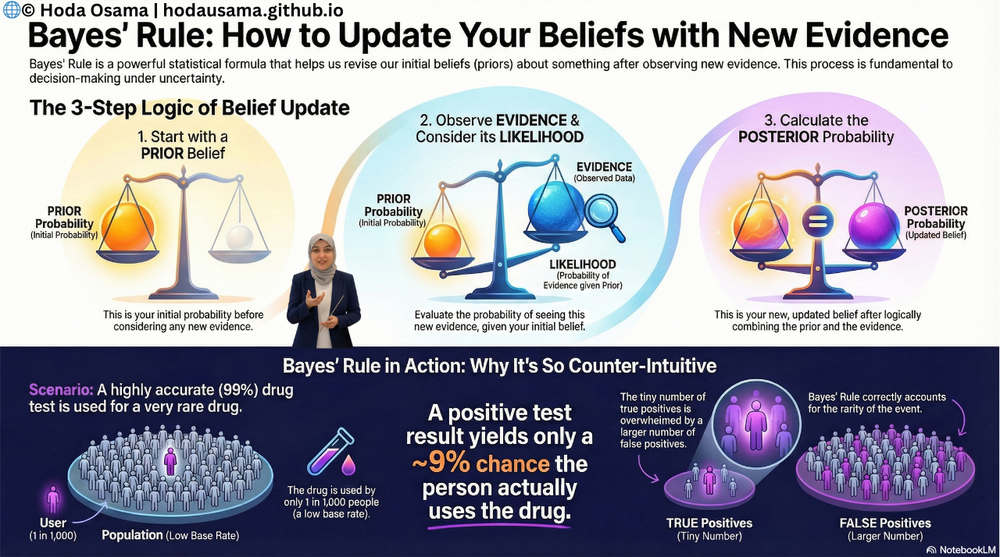
    </a>
    <h3>📈 Understanding Independence and Bayes’ Rule</h3>
    <a class="btn" href="/posts/Bayes-_Rule/">Read Lesson</a>
  

  
  <!-- Infographic Card: Probability -->
  <!-- 

    
    <h3>🎲 Intro to Probability</h3>
    <a class="btn" href="/posts/probability-intro/">Read Lesson</a>
  
 -->

 

<!-- Styling -->

<!-- JavaScript for Filtering -->

